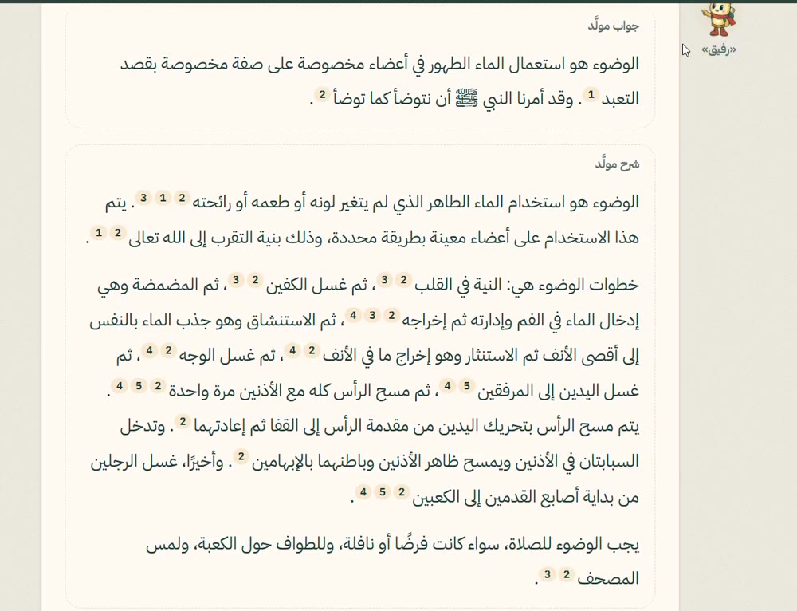
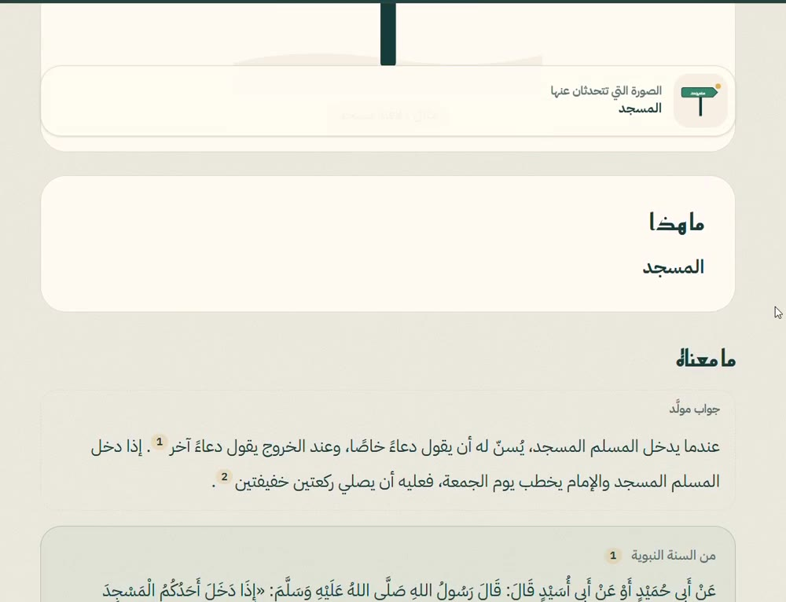
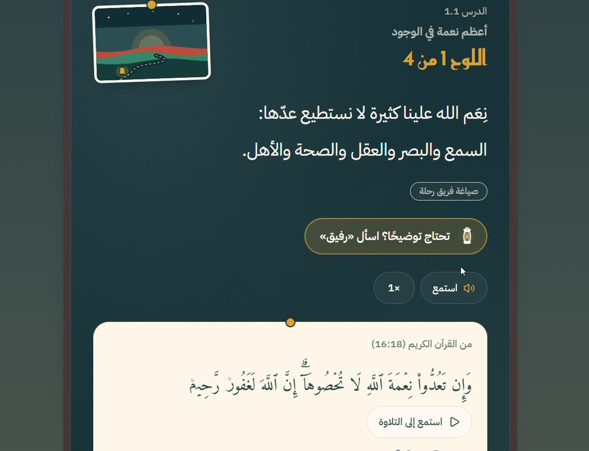
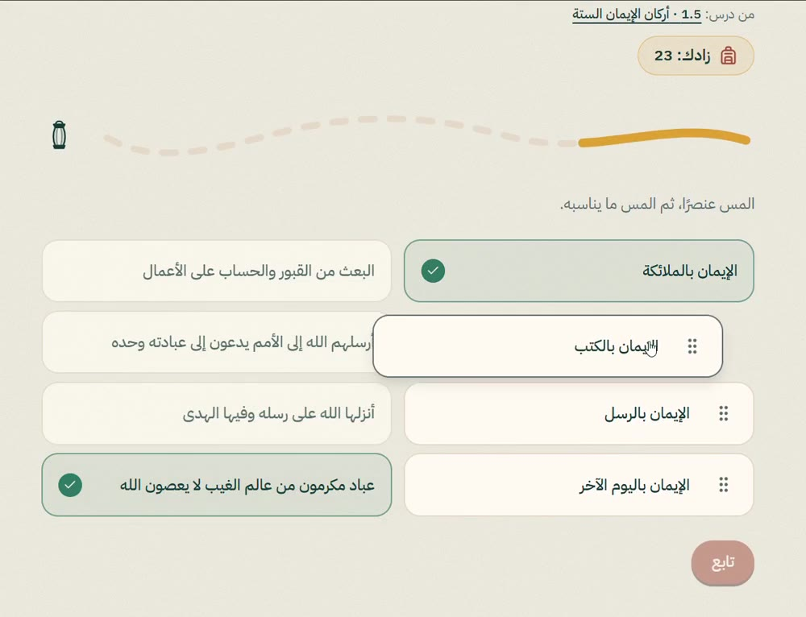
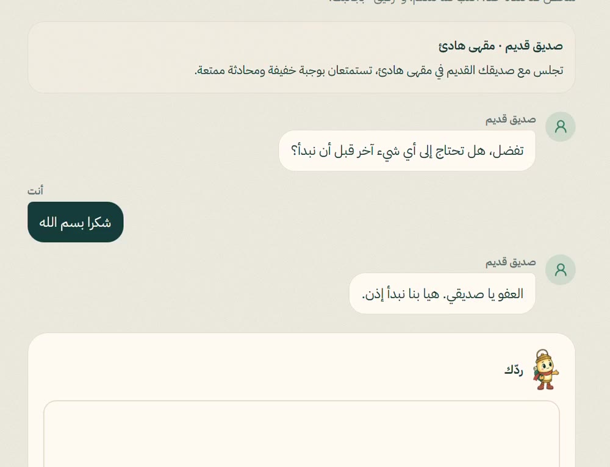
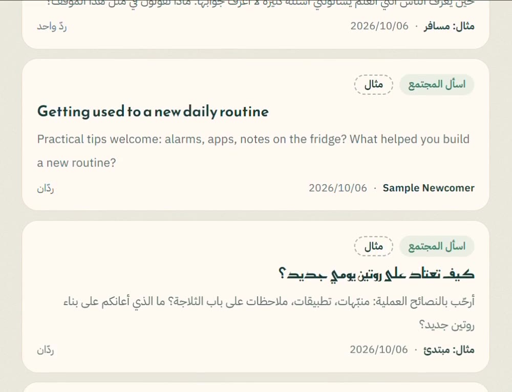
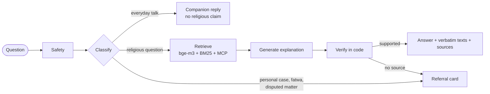

<div align="center">

# رحلة · Rehla

**رفيقك في الطريق إلى النور**
*Your companion on the road to the light*

[العربية](#العربية) · [English](#english)

**[النسخة الحية · Live](https://rehla-islamicaich-tfco-6igd.vercel.app/ar)** · [العرض التقديمي · Slides (PDF)](docs/media/rehla-presentation.pdf) · [فيديو العرض · Demo video](docs/media/rehla-demo.mp4)

 

</div>

---

<div dir="rtl">

## العربية

### نبذة

«رحلة» منصة ذكية ترافق المسلم الجديد من لحظة نطق الشهادة إلى الممارسة الواثقة والانتماء، بلغته ومن مصادر معتمدة.

يقدّمها فريق **ذكاء فلو** ضمن **تحدي الذكاء الاصطناعي في خدمة المحتوى الإسلامي**، في **المسار الثالث: التجارب التفاعلية والرحلة المعرفية للتعريف بالإسلام وتعلمه**.

### للمحكّمين: تحقّق في خمس دقائق

لا يلزم حساب ولا تثبيت. افتح [النسخة الحية](https://rehla-islamicaich-tfco-6igd.vercel.app/ar) وجرّب:

| جرّب | ما تراه |
|---|---|
| في **اسأل «رفيق»**: «كيف أتوضأ؟» | جواب مباشر، ثم شرح مُسنَد فقرة فقرة، ثم بطاقات المصادر بروابطها |
| في **اسأل «رفيق»**: «كم عدد ركعات الصلوات الخمس؟» | جواب من مصدر معتمد مع بطاقته |
| في **اسأل «رفيق»**: حالة شخصية تطلب حكمًا | كلمة طيبة وبطاقة الإحالة إلى مختص، بلا حكم من النموذج |
| في **عدسة**: اختر المثال «لافتة مسجد» ثم اسأل عنها | وصف الصورة، ثم الحديث بنصّه ومصدره، ثم محادثة عن الصورة |
| في **موقف**: افتح موقفًا وانتقل إلى «تدرّب» | حوار حر مع شخصية في مشهد جديد، ثم ملاحظات على ردّك |
| في **خطوات**: افتح الدرس الأول | درس تفاعلي على اللوح، وسؤال سريع، و«رفيق» بجانبه |

وللتحقق من الأرقام: كل جواب في التقييم ونتيجته وتكلفته في [`eval/results/`](eval/results)، وأوامر إعادته في [إعادة تشغيل التقييم](#إعادة-تشغيل-التقييم).

### صور من النسخة الحية

<div align="center">
  
  
</div>

خطوات · تدرّب · اسأل «رفيق» · عدسة · موقف · مجتمع رحلة

### المشكلة

بلغ عدد الداخلين في الإسلام في المملكة العربية السعودية 163,319 شخصًا في عام 2023 وحده، و347,646 شخصًا خلال خمس سنوات، وفق بيان وزارة الشؤون الإسلامية والدعوة والإرشاد ([وكالة الأنباء السعودية، يناير 2024](https://www.spa.gov.sa/N2031934)). وكثير منهم وافدون لا يتحدثون العربية.

بعد الشهادة مباشرة يواجه المسلم الجديد أسئلة عملية لا تحتمل التأجيل: كيف يتطهر ويصلي، وكيف يتصرف في المسجد لأول مرة، وماذا تعني النصوص العربية من حوله، ولمن يلجأ إذا تعثر. والمتابعة البشرية وحدها لا تستطيع مرافقته في يومه.

### الحل

منصة ويب بالعربية والإنجليزية، يقودها مساعد ذكي اسمه **«رفيق»**، حاضر في جميع أقسامها:

الأقسام المتاحة الآن في [النسخة الحية](https://rehla-islamicaich-tfco-6igd.vercel.app/ar):

| القسم | الوصف |
|---|---|
| **خطوات** | مسار تعلّم متدرج: دروس تفاعلية، واختبار «ماذا أعرف» قبل كل محطة واختبار في آخرها، وشرح لكل خطأ |
| **تدرَّب** | أنشطة الدروس كلها في مكان واحد، يجرّبها المتعلم متى شاء ويجمع بها زادًا لطريقه |
| **اسأل «رفيق»** | رفيق يحادثك كصديق في كل شيء: يستمع ويشجع ويساعدك في التخطيط ويجيب عن الأسئلة العامة. وحين يصل الحديث إلى الدين يجيب من المصادر المعتمدة وحدها: جواب مباشر، ثم النصوص بحروفها، ثم شرح، مع الامتناع والإحالة عند الحاجة |
| **عدسة** | صوّر شيئًا مما حولك (لافتة في مسجد، لوحة مواقيت، كتابة عربية): يصفه «رفيق» أولًا وصفًا عامًّا ويقرأ ما كُتب عليه، ثم يشرحه من المصادر المعتمدة حين تغطيه، وتواصل الحديث عنه |
| **موقف** | تدرّب على مواقف يومية (السلام، المسجد، الطعام، زيارة المريض…): ماذا تقول من المصادر، ثم حوار حر مع شخص في مشهد جديد، وملاحظات واختبار |
| **مجتمع رحلة** | مكان اختياري لتبادل التجربة والتشجيع باسم يختاره العضو. يُفحص كل نص قبل نشره: علامات الخطر، والبيانات الشخصية، والأحكام، وما يُنسب إلى الإسلام، والآيات والأحاديث المقتبسة؛ فلا يُنشر حكم ولا ادعاء كهذا ولا اقتباس، ولا يُنشر شيء إن تعذّر الفحص. البلاغ الواحد لا يُخفي شيئًا وحده: ثلاثة بلاغات تُخفي المنشور حتى يراجعه مشرفو فريق «رحلة» |

**مقترح ولم يُبنَ:** **أقم**، صلاة تدريبية بالكاميرا تنتهي بتقرير عن الأداء. القسم مخفي، وليس في النسخة الحية.

### كيف يعمل الذكاء الاصطناعي

لم ندرّب نموذجًا على النصوص الشرعية. بنينا فهرسًا من مصادر الحزمة المعتمدة يُبحث فيه عند كل سؤال، والنموذج يكتب الشرح فقط.



| التقنية | ماذا تضيف |
|---|---|
| **Hybrid RAG** (`baai/bge-m3` + BM25) | بحث بالمعنى وبالكلمة معًا في أكثر من 2,000 مقطع مفهرس، فيجد المصدر ولو اختلفت صياغة السؤال أو لغته |
| **LangGraph** | مسار من محطات (أمان، تصنيف، استرجاع، توليد، تحقق)، وقرارات الأمان والإحالة فيه مكتوبة في الشيفرة |
| **التحقق في الشيفرة** | فحوص على كل جواب قبل عرضه: لا ألفاظ ذكر أو دعاء يكتبها النموذج، ولا نسبة قول بلا نص مطابق، ولا عدد لا يذكره المصدر |
| **إدراج النص بالمرجع** | الآية والحديث والمصطلح تُدرج حرفيًا من مصادرها، ولا يكتبها النموذج |
| **VLM** (`google/gemini-2.5-flash`) | يقرأ صورة «عدسة»، ثم يمرّ المعنى بمسار المصادر نفسه |
| **MCP** (خادم جمعية المحتوى الإسلامي) | استرجاع حي للآيات والأحاديث وقت السؤال، ولا يُخزَّن منه شيء |
| **LLM-as-Judge** | تقييم على أسئلة التحدي الرسمية، وكل نتيجة منشورة في المستودع |

**بالأرقام:** أكثر من 2,000 مقطع مفهرس · 15 مرجعًا معتمدًا موثّقًا في [docs/SOURCES.md](docs/SOURCES.md) · 14 جهة إحالة مرخّصة · 19 درسًا · 12 موقفًا · أكثر من 800 اختبار آلي.

### أين تجد كل معيار من معايير التحكيم

| المعيار | أين تجده |
|---|---|
| جودة الحل التقني وتوظيف الذكاء الاصطناعي (25%) | الجدول أعلاه، و[البنية](docs/ARCHITECTURE.md)، و[أدوات MCP](docs/MCP_TOOLS.md)، والشيفرة في `ai/app/` و`web/src/` |
| تحقيق النفع وفق معيار نجاح المسار (20%) | رحلة متدرجة باختبار قبل كل محطة وبعدها ودفتر يُري المتعلم تقدّمه: [قياس الفهم](docs/UNDERSTANDING.md)، [المنهج](docs/CURRICULUM.md) |
| الموثوقية والسلامة العلمية (15%) | ستة فحوص نتيجتها صفر على 53 سؤالًا، مع ما لم ينجح بعد مذكورًا بصراحة: [التقييم](docs/EVALUATION.md)، [الموثوقية](docs/RELIABILITY.md)، [المصادر](docs/SOURCES.md) |
| الابتكار والقيمة المضافة (15%) | رفيق واحد حاضر في كل قسم، و«عدسة» لفهم ما حول المتعلم، و«موقف» للتدرّب قبل الموقف الحقيقي |
| تجربة المستفيد والتواصل والإتاحة (10%) | واجهة عربية وإنجليزية للجوال والحاسوب، تعمل للزائر بلا حساب، مع زر استماع للعبارات |
| واقعية التشغيل والاستكمال (10%) | نسخة حية، وتكلفة مقيسة لكل سؤال، وحد يومي للأسئلة، وخطة ما بعد التحدي: [التشغيل والتكلفة](docs/OPERATIONS.md)، [النشر](docs/DEPLOY.md) |
| وضوح العرض وإتاحة التحقق (5%) | هذا الملف، و[العرض](docs/media/rehla-presentation.pdf)، و[الفيديو](docs/media/rehla-demo.mp4)، ونتائج كل سؤال في [`eval/results/`](eval/results) |

### ما بُني ويعمل، وما هو مقترح بعده

**يعمل الآن:**

- «رفيق» صديق يحادث المتعلم افتراضيًا (يستمع ويشجع ويخطط معه ويجيب عن الأسئلة العامة) بلا أي ادعاء ديني من عنده، ولا يدخل المسار المُسنَد إلا للجزء الديني من الرسالة: جواب مباشر، ثم النصوص بحروفها، ثم شرح مُسنَد فقرة فقرة، مع فحوص في الشيفرة على كل جواب (لا ألفاظ ذكر أو دعاء يكتبها النموذج، ولا نسبة قول إلى النبي ﷺ أو القرآن بلا نص مطابق، ولا عدد لا يذكره المصدر)، والامتناع والإحالة حين يلزم ([الموثوقية](docs/RELIABILITY.md)).
- العربية والإنجليزية مدعومتان. والأردية والبنغالية والفرنسية تجريبية: الإجابة فيها استخراجية (الآيات والأحاديث كما نُشرت، وعبارات ثابتة تنتظر مراجعة متحدث أصلي). ويُبحث في المصادر بالعربية والإنجليزية لسؤال بأي لغة.
- مسرد الجهة المنظِّمة: ترجمة المصطلح منه مباشرة، والصيغة المعتمدة في كل جواب بغير العربية.
- «خطوات» بمحطاتها ودروسها التفاعلية، واختبار «ماذا أعرف؟» قبل كل محطة واختبارها في آخرها، ودفتر الرحلة يُري المتعلم تقدّمه ([قياس الفهم](docs/UNDERSTANDING.md)).
- «عدسة» محادثةً حول صورة تبدأ بوصف عام مفيد دائمًا، و«موقف» حوارًا حرًّا من خمسة أدوار مع ملاحظات في آخره (وعبارات «موقف» تُعرض بالعربية دائمًا مع زر استماع بصوت الجهاز، وفي الواجهة الإنجليزية مع نطق تقريبي بحروف لاتينية يُولَّد بقواعد ثابتة ومع المعنى من الترجمة المنشورة)، و«مجتمع رحلة».
- تقييم اللجنة على النماذج الإنتاجية، مع مقارنة بالنموذج وحده وتكلفة كل سؤال ([التقييم](docs/EVALUATION.md)، [التشغيل والتكلفة](docs/OPERATIONS.md)).

**مقترح بعد ذلك:** مراجعة علمية للدروس والمواقف، ورفع نسبة نجاح تقييم اللجنة، وإذن ناشر «بينات»، وقياس تكلفة «عدسة» و«موقف»، ودراسة لقياس الفهم مع متعلمين حقيقيين بموافقتهم، و«أقم». التفاصيل في [docs/OPERATIONS.md](docs/OPERATIONS.md).

### المبادئ

- **الإسناد:** كل معلومة شرعية تُعرض مع مصدرها، ولا يُنسب قول إلى مرجع لا يوجد فيه.
- **الامتناع والإحالة:** عند غياب المرجع، أو في المسائل الشخصية والخلافية، يمتنع «رفيق» ويحيل إلى مختص. لا يُصدر النظام فتوى.
- **النص الشرعي لا يُولَّد:** الآيات والأحاديث تُعرض حرفيًا من مصادرها المعتمدة.
- **الشفافية:** يُفصح «رفيق» عن كونه أداة ذكاء اصطناعي، لا مختصًا بشريًا.
- **الخصوصية:** يحدد المستخدم مرحلته بنفسه، ولا يستنتج النظام أي سمة دينية أو حساسة عنه.

### المرجعية العلمية

يعتمد المحتوى على المصادر الواردة في «المرجعية والحزمة العلمية والبيانات» الصادرة عن التحدي. سجل المصادر والتراخيص كاملًا في [docs/SOURCES.md](docs/SOURCES.md) وفي صفحة «المصادر» داخل المنصة.

### التشغيل محليًا

المتطلبات: Node.js 20.9 أو أحدث، وPython 3.12 أو أحدث، و[uv](https://docs.astral.sh/uv/).

**1. خدمة الذكاء الاصطناعي** (FastAPI على المنفذ 8000). تبدأ الخدمة وتجيب عن `/health` دون مفاتيح، لكن «رفيق» و«عدسة» و«موقف» تحتاج `OPENROUTER_API_KEY` وأسماء النماذج في الملف `ai/.env` (انظر `ai/.env.example` و[docs/DEPLOY.md](docs/DEPLOY.md)). وبدونها تجيب هذه الأقسام بأنها غير متاحة الآن:

<div dir="ltr">

```bash
cd ai
cp .env.example .env
uv sync
uv run uvicorn app.main:app --reload --port 8000
```

</div>

**2. تطبيق الويب** (Next.js على المنفذ 3000). يتصل بالخدمة عبر `AI_SERVICE_URL`، وقيمته الافتراضية `http://localhost:8000`:

<div dir="ltr">

```bash
cd web
cp .env.example .env.local
npm install
npm run dev
```

</div>

ثم افتح `http://localhost:3000/ar` للعربية أو `http://localhost:3000/en` للإنجليزية.

**الفحوص:**

<div dir="ltr">

```bash
cd web && npm run lint && npm run typecheck && npm run build
cd ai && uv run ruff check && uv run mypy app tests && uv run pytest
```

</div>

### إعادة تشغيل التقييم

يمكن إعادة أرقام [docs/EVALUATION.md](docs/EVALUATION.md) بمفتاح OpenRouter خاص بك، والأوامر في القسم الإنجليزي أدناه ([Re-running the evaluation](#re-running-the-evaluation)). يستعمل التشغيل النماذج الإنتاجية أيًّا كان ما في `ai/.env`، ولا يحتاج غير `OPENROUTER_API_KEY`.

### الفريق

**ذكاء فلو (Thakaa Flow)**

- محمد بابكر: مهندس ذكاء اصطناعي
- فيصل الحارثي: المدير التنفيذي لذكاء فلو، مهندس برمجيات

### حالة المشروع

**النسخة الحية:** [https://rehla-islamicaich-tfco-6igd.vercel.app](https://rehla-islamicaich-tfco-6igd.vercel.app/ar)

**النماذج:** `google/gemini-2.5-flash` لـ«رفيق» و«موقف» و«عدسة» (والاحتياطي `google/gemini-2.5-flash-lite`)، و`baai/bge-m3` للبحث، عبر OpenRouter؛ بنحو 0.005 دولار للسؤال على مجموعة الاختبار النهائية ([التشغيل والتكلفة](docs/OPERATIONS.md)).

بدأ البناء مع انطلاق أيام التحدي في **4 أكتوبر 2026**، ويوضح الملف [docs/START_STATE.md](docs/START_STATE.md) حالة المستودع قبل ذلك. التوثيق التقني: [البنية](docs/ARCHITECTURE.md)، [الموثوقية](docs/RELIABILITY.md)، [التقييم](docs/EVALUATION.md)، [التشغيل والتكلفة](docs/OPERATIONS.md)، [الخصوصية](docs/PRIVACY.md)، [المصادر](docs/SOURCES.md)، [النشر](docs/DEPLOY.md).

</div>

---

## English

### Overview

**Rehla** ("journey" in Arabic) is an AI-powered platform that accompanies new Muslims from the moment they declare the Shahada to confident practice and belonging, in their own language and grounded in approved sources.

It is built by **Thakaa Flow** for the **AI Challenge Serving Islamic Content**, in **Track 3: Interactive experiences and the learning journey for introducing and teaching Islam**.

### For the judges: verify in five minutes

No account and no install. Open the [live version](https://rehla-islamicaich-tfco-6igd.vercel.app/en) and try:

| Try | What you see |
|---|---|
| In **Ask Rafiq**: "How do I make wudu?" | A direct answer, an explanation cited paragraph by paragraph, then the source cards with their links |
| In **Ask Rafiq**: "How many rak'ahs are in the five prayers?" | An answer from an approved source, with its card |
| In **Ask Rafiq**: a personal case asking for a ruling | A kind word and the specialist card; no ruling from the model |
| In **Lens**: pick the "mosque sign" example, then ask about it | A description of the picture, the hadith verbatim with its source, then a conversation about the picture |
| In **Mawqif**: open a situation and go to "Practise" | A free conversation with a character in a fresh scene, then feedback on your reply |
| In **Khutuwat**: open the first lesson | An interactive lesson on the board, a quick question, and Rafiq beside it |

To check the numbers: every evaluated answer, its verdict and its cost are in [`eval/results/`](eval/results), and the commands to rerun them are under [Re-running the evaluation](#re-running-the-evaluation).

### Screens from the live version

<div align="center">
  
  
</div>

Khutuwat · Practice · Ask Rafiq · Lens · Mawqif · Rehla Community

### The problem

163,319 people embraced Islam in Saudi Arabia in 2023 alone, and 347,646 over five years, according to the Ministry of Islamic Affairs, Dawah and Guidance ([Saudi Press Agency, January 2024](https://www.spa.gov.sa/N2031934)). Many of them are expatriates who do not speak Arabic.

Right after the Shahada, a new Muslim faces practical questions that cannot wait: how to purify and pray, how to behave in a mosque for the first time, what the Arabic texts around them mean, and who to turn to when stuck. Human follow-up alone cannot be present in their every day.

### The solution

A bilingual web platform (Arabic and English) led by one AI companion, **Rafiq**, present in every section:

The sections switched on in the [live version](https://rehla-islamicaich-tfco-6igd.vercel.app/en):

| Section | Description |
|---|---|
| **Khutuwat** (Steps) | A graded learning path: interactive lessons, a "what do I already know" check before each station and an exam at its end, and an explanation for every mistake |
| **Practice** | Every lesson activity in one place, to try at any time and gather provisions for the road |
| **Ask Rafiq** | Rafiq talks with you like a friend about anything: he listens, encourages, helps you plan and answers general questions. When the talk turns to religion, he answers from approved sources only: a direct answer, the sources verbatim, then an explanation; abstention and referral when needed |
| **Adasa** (Lens) | Photograph something around you (a sign in a mosque, a prayer-times board, Arabic writing): Rafiq first describes it in general terms and reads what is written on it, then explains it from the approved sources where they cover it, and you talk about it |
| **Mawqif** (Situations) | Practise everyday situations (greeting, the mosque, a meal, visiting the sick…): what to say from the sources, then a free conversation with someone in a fresh scene, feedback and a test |
| **Rehla Community** | An opt-in place to share experience and encourage each other under a chosen community name. Before anything is shared it is checked for danger, personal details, rulings, claims about what Islam says and quoted verses or hadiths; such a ruling, claim or quote is not published, and nothing is published when the check cannot run. One report hides nothing by itself: three reports hide an item until the Rehla team's moderators review it |

**Proposed, not built:** **Aqim**, a camera-based practice prayer that ends with a performance report. The section is hidden and is not in the live version.

### How the AI works

No model was trained on religious texts. We built an index of the approved sources that is searched on every question; the model only writes the explanation.


| Technique | What it adds |
|---|---|
| **Hybrid RAG** (`baai/bge-m3` + BM25) | Search by meaning and by word together over more than 2,000 indexed passages, so the source is found whatever the wording or language of the question |
| **LangGraph** | A path of stations (safety, classify, retrieve, generate, verify); the safety and referral decisions are written in code |
| **Verification in code** | Checks on every answer before it is shown: no words of dhikr or du'a written by the model, no attribution without a matched text, no amount the source does not give |
| **Text inserted by reference** | Verses, hadiths and terms are inserted verbatim from their sources; the model never writes them |
| **VLM** (`google/gemini-2.5-flash`) | Reads the Lens photo; the meaning then takes the same sourced path |
| **MCP** (the Association's Islamic content server) | Live retrieval of verses and hadiths at question time; nothing from it is stored |
| **LLM-as-Judge** | Evaluation on the challenge's official questions, with every result published in this repository |

**In numbers:** more than 2,000 indexed passages · 15 approved references recorded in [docs/SOURCES.md](docs/SOURCES.md) · 14 licensed referral bodies · 19 lessons · 12 situations · more than 800 automated tests.

### Where to find each judging criterion

| Criterion | Where it is |
|---|---|
| Technical quality and use of AI (25%) | The table above, [architecture](docs/ARCHITECTURE.md), [MCP tools](docs/MCP_TOOLS.md), and the code in `ai/app/` and `web/src/` |
| Benefit by the track's success criterion (20%) | A graded journey with a check before each station and an exam after it, and a journal showing the learner their progress: [measuring understanding](docs/UNDERSTANDING.md), [curriculum](docs/CURRICULUM.md) |
| Reliability and scholarly safety (15%) | Six checks that must be zero, measured on 53 questions, with what still fails stated plainly: [evaluation](docs/EVALUATION.md), [reliability](docs/RELIABILITY.md), [sources](docs/SOURCES.md) |
| Innovation and added value (15%) | One companion present in every section; Lens to understand the surroundings; Mawqif to practise before the real moment |
| Learner experience, communication and access (10%) | Arabic and English interface for phone and desktop, usable as a guest with no account, with a listen button for phrases |
| Realistic operation and completion (10%) | A live deployment, a measured cost per question, a daily question cap, and the plan after the challenge: [operations and cost](docs/OPERATIONS.md), [deployment](docs/DEPLOY.md) |
| Clarity and verifiability (5%) | This file, the [slides](docs/media/rehla-presentation.pdf), the [video](docs/media/rehla-demo.mp4), and every result in [`eval/results/`](eval/results) |

### Built and working, and proposed next

**Working now:**

- Rafiq as a companion who talks by default (listens, encourages, plans, answers general questions) and makes no religious claim of his own; only the religious part of a message takes the sourced path: a direct answer, the sources verbatim, then an explanation cited paragraph by paragraph, every answer checked in code (no words of dhikr or du'a written by the model, no words attributed to the Prophet ﷺ or the Quran without a matched text, no amount the source does not give), with abstention and referral where needed ([reliability](docs/RELIABILITY.md)).
- Arabic and English are supported. Urdu, Bengali and French are experimental: answers in them are extractive (verses and hadiths as published, fixed lines awaiting native review). Sources are searched in Arabic and English for a question in any language.
- The organisers' glossary: terms translated from it directly, and its approved forms in every answer that is not in Arabic.
- Khutuwat's stations and interactive lessons, a "What do I already know?" check before each station and an exam at its end, and the journal showing the learner their own progress ([measuring understanding](docs/UNDERSTANDING.md)).
- Lens as a conversation about a photo that always starts with a useful general description, Mawqif as a free five-turn conversation with feedback at the end (its phrases are always taught in Arabic, with a "listen" button using the device's voice, and on English pages an approximate pronunciation made by fixed rules and the meaning from the published translation), and Rehla Community.
- The committee evaluation on the production models, with a model-alone baseline and the cost of each question ([evaluation](docs/EVALUATION.md), [operations and cost](docs/OPERATIONS.md)).

**Proposed next:** scholarly review of the lessons and situations, a higher committee pass rate, the publisher's permission for «بينات», measured costs for Lens and Mawqif, a study of the understanding measure with real learners and their consent, and Aqim. Details in [docs/OPERATIONS.md](docs/OPERATIONS.md).

### Principles

- **Attribution:** every religious statement is shown with its source; nothing is attributed to a reference that does not contain it.
- **Abstention and referral:** when no reference is found, or for personal and disputed matters, Rafiq abstains and refers to a qualified person. The system does not issue fatwas.
- **Sacred text is never generated:** Quran verses and hadiths are displayed verbatim from their approved sources.
- **Transparency:** Rafiq discloses that it is an AI tool, not a human specialist.
- **Privacy:** users state their own stage; the system does not infer any religious or sensitive attribute about them.

### Scholarly reference

Content relies on the sources listed in the challenge's official scholarly reference package. Every source, with its licence and where it is used, is in [docs/SOURCES.md](docs/SOURCES.md) and on the product's Sources page.

### Run locally

Requirements: Node.js 20.9+, Python 3.12+ and [uv](https://docs.astral.sh/uv/).

**1. AI service** (FastAPI on port 8000). It starts and answers `/health` without keys, but Rafiq, Lens and Mawqif need `OPENROUTER_API_KEY` and the model names in `ai/.env` (see `ai/.env.example` and [docs/DEPLOY.md](docs/DEPLOY.md)); without them those sections say they are unavailable:

```bash
cd ai
cp .env.example .env
uv sync
uv run uvicorn app.main:app --reload --port 8000
```

**2. Web app** (Next.js on port 3000). It reaches the AI service through `AI_SERVICE_URL`, which defaults to `http://localhost:8000`:

```bash
cd web
cp .env.example .env.local
npm install
npm run dev
```

Then open `http://localhost:3000/ar` (Arabic) or `http://localhost:3000/en` (English).

**Checks:**

```bash
cd web && npm run lint && npm run typecheck && npm run build
cd ai && uv run ruff check && uv run mypy app tests && uv run pytest
```

### Re-running the evaluation

The numbers in [docs/EVALUATION.md](docs/EVALUATION.md) can be reproduced with your own OpenRouter key. The run uses the production models whatever `ai/.env` names, and calls no service of ours.

```bash
cd ai
cp .env.example .env        # then set OPENROUTER_API_KEY (nothing else is needed)
uv sync
uv run python ../eval/committee.py              # the committee set: 56 items, about 25 minutes
uv run python ../eval/committee.py --baseline   # the same model with a plain prompt, for comparison
uv run python ../eval/committee.py --run 2      # the set again, to measure agreement between runs
```

Each run writes `eval/results/2026-10-05-committee*.json`: every answer as shown, the judge's verdict and reason for each criterion, and the tokens and cost of each question. `JUDGE_MODEL` changes the judge (default `openai/gpt-6-luna`). A full run costs about $0.07 in Rafiq's model calls and about $0.02 for the judge.

### Team

**Thakaa Flow**

- Mohamed Babikir: AI Engineer
- Faisal Al-Harthi: CEO of Thakaa Flow, Software Engineer

### Project status

**Live:** [https://rehla-islamicaich-tfco-6igd.vercel.app](https://rehla-islamicaich-tfco-6igd.vercel.app/en)

**Models:** `google/gemini-2.5-flash` for Rafiq, Mawqif and Lens (fallback `google/gemini-2.5-flash-lite`) and `baai/bge-m3` for retrieval, through OpenRouter; about $0.005 per question on the final regression set ([operations and cost](docs/OPERATIONS.md)).

The build started with the challenge build days on **October 4, 2026**; [docs/START_STATE.md](docs/START_STATE.md) records the repository's state before then. Technical documentation: [architecture](docs/ARCHITECTURE.md), [reliability](docs/RELIABILITY.md), [evaluation](docs/EVALUATION.md), [operations and cost](docs/OPERATIONS.md), [privacy](docs/PRIVACY.md), [sources](docs/SOURCES.md), [deployment](docs/DEPLOY.md).
