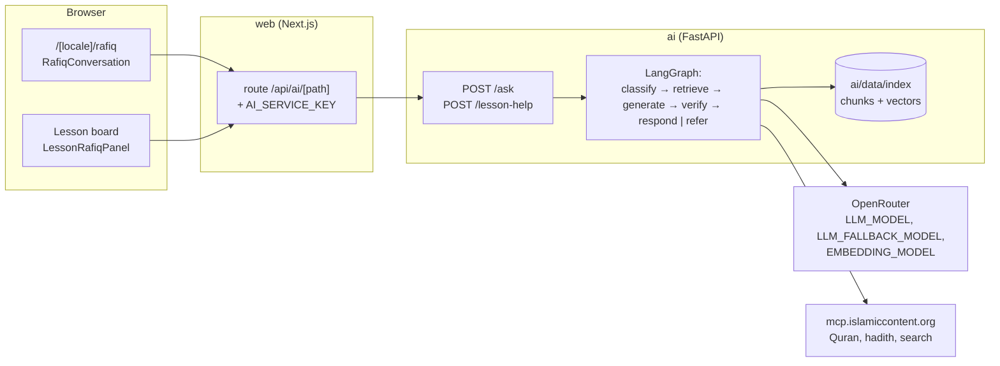

# Architecture

```
web/       Next.js (App Router, TypeScript, Tailwind, next-intl): the product, in Arabic (RTL) and English (LTR)
supabase/  SQL for the optional accounts (profiles and progress, row level security)
ai/        FastAPI + LangGraph (Python): Rafiq
content/   Lessons, sources, the stored source corpus (data, not code)
eval/      Rafiq's reliability cases, runner and results
docs/      This file, DEPLOY, RELIABILITY, EVALUATION, PRIVACY, SOURCES, CURRICULUM, COVERAGE, MCP_TOOLS
```

## Rendering and speed

Every main page is rendered at build time: the home page, Khutuwat (road, lessons, station checks and exams, journal), Practice (index and each activity), Rafiq, the specialists and the sources, in both locales. Moving between them is instant because `<Link>` prefetches each one in full.

- **Static by rule.** Each main page exports `dynamic = "error"`, so a request-time API (headers, cookies, an uncached fetch) fails the build instead of quietly making the page dynamic. `scripts/check-static.mjs` runs after `next build` and fails it if any main page is missing from the prerender manifest.
- **Nothing per request in the layout.** The footer's AI status is checked from the browser (`/api/ai/health`, once per visit), never on the server.
- **Content once per process.** `src/lib/content/memo.ts` reads and validates each content file once per process in production (and per request in development, so edits show up).
- **Only the messages a page needs.** The layout sends its client components' namespaces; each page adds its own (`src/i18n/client-namespaces.ts`). A test follows each page's imports (`src/i18n/client-graph.ts`) and fails when a client component reads a namespace its page does not send.
- **Heavy parts load when used.** The lesson conversation panel, the Khutuwat tour and its previews load only when opened, each in its own Suspense boundary so the page never waits for them. The browser validates Rafiq's replies with `zod/mini`.
- **A designed wait.** Each route segment has a loading state in the shape of its page (`src/components/layout/page-loading.tsx`): the header stays, and Rafiq's lantern breathes (still under reduced motion).

## Khutuwat tour and Practice

- **The tour** (`src/components/guide/`) opens the first time the learner enters `/learn`, as a panel at the bottom of the screen with no backdrop: one idea per step, each beside the real thing in miniature (the stations, a board line with its source, the shortest ordering activity of the road, one of the lessons' own questions, Rafiq). "Skip" or Escape closes it for good on the device; "How Rehla works" on the learn page and in the footer opens it again.
- **Practice** (`/[locale]/practice`, flag `practice`) gathers every activity of the road's lessons by station, from the same lesson data and components (`src/lib/learn/practice.ts`), except reflections and private checklists. Each activity has its own static page: the activity full width, then its lesson's short questions (card checks and quiz). Provisions are earned once per activity (3) and per question answered right (1), are never taken away, and are kept in the learner's progress record (`practice.earned`, `practice.best`, keyed by id, so an account joins two devices' provisions without counting any twice).

The browser talks only to the web app. A route handler (`web/src/app/api/ai/[path]/route.ts`, `web/src/lib/ai-proxy.ts`) forwards `/api/ai/ask`, `/api/ai/lesson-help`, `/api/ai/lens` and `/api/ai/health` to the AI service at `AI_SERVICE_URL`, adding the shared key `AI_SERVICE_KEY` and the learner's address; the key and the provider keys never reach the browser. The service refuses any request without the key when `AI_SERVICE_KEY` is set (`ai/app/security.py`) and sends no CORS headers, so no page can call it directly. Sections are switched on in `web/src/config/features.ts`; navigation shows only the sections that are on.

## Optional accounts

A learner can keep progress in an account, so it follows them across devices. Nothing requires one: without an account Rehla works exactly as before, with everything on the device.

- **On only when configured.** `src/config/accounts.ts` turns accounts on when `NEXT_PUBLIC_SUPABASE_URL` and `NEXT_PUBLIC_SUPABASE_PUBLISHABLE_KEY` are both set. Without them, the header entry, the invitation and the account pages are gone (the pages answer 404), and no Supabase code is loaded.
- **Authentication lives in the browser.** supabase-js keeps the session in `localStorage` (`rehla.auth.v1`) and is downloaded only when a stored session exists or a form is sent (`src/lib/account/client.ts`). There is no auth middleware and no per-request session on the server, so every page stays rendered at build time, account pages included (`check-static.mjs` checks them when accounts are on).
- **One server route.** `POST /api/account/delete` checks the learner's access token, sent in the `Authorization` header, then deletes the user with `SUPABASE_SECRET_KEY` (`src/lib/account/admin.ts`, `server-only`). That is the only place the secret key is read; a test keeps it so.
- **Data** (`supabase/migrations/`): `profiles` (display name, optional country from the app's list, which the database enforces for IL too, page language) and `progress_items` (one row per item the device already records by id), both with row level security: each signed-in learner reaches only their own rows; anonymous visitors reach nothing. A future community view can expose display name and country without loosening these tables.
- **What is never carried:** Rafiq's conversations, the conversations beside lesson boards, the name given to Rafiq, the chosen city, personal checklists and the anonymous session id. The display name is never sent to the AI service; a test checks that no module that talks to it reads the account.

### Sync

`src/lib/account/sync.ts` keeps the account in step with the device:

- **On sign-in and on each page load with a session,** it reads the account's rows, joins them with the device's progress (`src/lib/account/items.ts`), writes the result to the device, and sends the difference.
- **While signed in,** the device is written first; changes go to the account about two seconds after the last one, in batches of 500. Offline, they wait on the device and are sent when the connection returns. The journal shows "Saved", "Saving…" or "Offline".
- **Erasing the journal** while signed in erases it from the account too.
- **On sign-out,** everything waiting is sent first; if it cannot be, the learner is told and chooses. Then the device is emptied of personal data, keeping only the language (in the address), the board sound setting and the dismissed invitation.
- **Another tab signing out** never empties the account: nothing is sent once the stored session is gone.

Joining rules, for an item both sides hold:

| Item id | What it is | Which wins |
|---|---|---|
| `lesson:{lessonId}` | a completed lesson | the earlier completion |
| `start` | the station the learner chose to start from | this device's choice, or the account's if the device has none |
| `question:{questionId}` | a question's history | the latest answer; the higher "seen" count |
| `quiz:{lessonId}` | a lesson quiz | the more recent |
| `baseline:{stationId}` | "what do I already know?" | the earlier: it records what was known before |
| `exam:{stationId}` | a station exam | passed over not passed; otherwise the more recent |
| `pick:{lessonId}` | the sentence kept in the journal | this device's |
| `earned:{id}` | provisions earned | one entry per id: the higher points, the earlier date. Never counted twice, never fewer than either side had |
| `best:{activityKey}` | an activity's best round | the higher share right; on a tie, the later |
| `tour` | the Khutuwat tour was seen | seen if either side saw it |

Items only one side holds are kept.

## Mawqif («موقف»)

A new Muslim practises everyday situations before meeting them (`/[locale]/mawqif`, flag `mawqif`): the greeting, the mosque, the adhan, a meal, a sneeze, coming home, an invitation, visiting the sick, condolences, a colleague's question, the first Friday, the first day of fasting. `docs/MAWQIF_COVERAGE.md` lists each situation and the source behind every statement in it.

- **Content** (`content/situations/*.json`, schema in `web/src/lib/content/situation-schema.ts`): a scene (team wording, labelled), "what to say", "why" and "when" as quotes, two role-play turns, and two checks. Every religious item is a quote: an exact excerpt, in each language, of a stored HadeethEnc hadith, a QuranEnc verse or an approved book (textRef). Each turn has key points (quotes) and three written replies (best, acceptable, to avoid) that name the key points they meet. `situation-content.test.ts` checks every quote against the stored text byte for byte, both languages, citations against HadeethEnc's own attribution, and that no team line repeats words of a verse or hadith. `scripts/fetch-content.mjs` fetches the hadiths and verses the situations cite.
- **Pages** (all rendered at build time): the map of situations as stops on the road (not started, practised, mastered), one page per situation (scene, learn, role-play, summary, check), and the final tests after every four situations and for the whole section, with a score, every question's answer and source, and an analysis (handled well, practise again, lessons to revisit).
- **The role-play.** The learner replies by choosing one of the written replies (no AI) or by writing their own. Feedback is built by the page from fixed lines and the quoted sources of the missing key points; «رفيق» stands beside the learner as the coach, with the `{{name}}` placeholder filled on the device.
- **Evaluating a written reply** (`POST /mawqif/evaluate`, `ai/app/mawqif/`): the reply first passes the danger check in code; then one model call reports which of the turn's key points it covers (by id), its tone, whether it is a religious question instead of a reply (offered to Rafiq) or distress (the specialist card), and one encouraging sentence, which must pass Rafiq's warm-line checks or is dropped. A 20-second budget; when the service is unavailable, the turn falls back to the written choices. The key points reach the service through `app/prepare.py` (`ai/data/index/mawqif-turns.json`). Nothing typed is stored or logged.
- **Progress** is kept like Practice's: provisions once per turn answered with the best reply and per right answer, and the best round of each check and test, in the learner's progress record (device for guests, account when signed in).

## Lens («عدسة»)

A learner photographs something around them (a sign in a mosque, a prayer mat, a wudu area, Arabic writing) and Lens says what it is and what it means, from the approved sources. Page: `/[locale]/lens` (flag `adasa`). Service: `POST /lens` (`ai/app/lens/`), reached through the web proxy (`/api/ai/lens`).

Three steps, kept apart in code and on screen:

1. **SEE** (`lens.py`, `prompts/see.md`): a vision model (`VLM_MODEL`, then `VLM_FALLBACK_MODEL`) reports what the photo shows as strict JSON (`Seen` in `schemas.py`): kind, a neutral subject, the text read and its language, a translation of ordinary text only, whether the text looks like scripture, whether people are present, a confidence, a category, the photo's quality, religious terms that appear in the text, and other things in the photo. It explains nothing, gives no ruling, describes no person, and treats any instruction written in the photo as text. Invalid JSON is asked again once, then the fallback model is asked, then the reply is the unclear card.
2. **DECIDE** (`decide.py`): code applies the decision table in `docs/RELIABILITY.md` to that report. Text that looks like scripture, and Arabic phrases of three to thirty words, are looked up with `Retriever.find_quoted`, the same lookup Rafiq uses for a quoted verse; only an exact match counts.
3. **EXPLAIN**: only for the rows that answer, the subject, or a religious term the text really holds, becomes an ordinary question to Rafiq ("What is X, and what does it mean for a Muslim?"), so the answer is a normal `RafiqAnswer` with every Rafiq check and card. A matched verse or hadith is shown as its published block with no model text at all; a paper about the learner's own situation gets the specialist card with no ruling.

**Limits.** The browser downscales a photo to 1280 px, re-encodes it as JPEG (which leaves its metadata behind) and sends at most 4 MB; the service checks the size and the file's own signature. `/lens` has its own limit (`LENS_PER_MINUTE`, 5 per minute per address), the shared service key, and a 45-second budget that ends in a friendly card. The image is held in memory for the SEE call only; logs carry the kind, the row, the card and the timing.

**Examples.** Four drawn examples (original SVG) let a visitor without a camera try Lens: each sends a stored `seen` result, so only EXPLAIN runs, and the screen marks it "Example".

## Rafiq and the learner's name

Rafiq never sees the learner's name. He may write the placeholder `{{name}}` in a warm line (`opening`, `followUp`, a reply to small talk); the page fills it in on the device (`web/src/lib/rafiq/name.ts`), or removes it with its vocative or comma when there is no name. Code keeps it out of the cited answer and out of two replies in a row (`ai/app/rafiq/name.py`). The name is the account's display name when signed in, otherwise the one given on this device.

## Account or guest

The first time a visitor who is not signed in opens Khutuwat, Practice or Rafiq, one dialog offers an account or guest use as two equal choices (`web/src/components/account/account-choice.tsx`). It is a client-side check after hydration, so pages stay static and a signed-in learner never sees it. The choice is kept on the device; the Khutuwat tour opens only after it is answered.

## Rafiq



### The AI service (`ai/`)

| Module | Responsibility |
|---|---|
| `app/main.py` | The FastAPI app (Vercel's entrypoint, `app.main:app`). The rate limiter starts with the app; the index, embedder, MCP client, chat models and Rafiq are built on the first question, so a cold instance answers `/health` at once. |
| `app/security.py` | The shared key with the web app's proxy (`AI_SERVICE_KEY`), and the learner's address the proxy passes along. |
| `app/prepare.py` | Copies what the service reads at runtime from `content/` into `ai/data/index/` and checks the index is complete; Vercel's build step, also run locally. |
| `app/api.py` | `POST /ask` and `POST /lesson-help`: validation, per-IP rate limit, error shapes. Nothing about a question is logged. |
| `app/rafiq/graph.py` | The LangGraph graph and its nodes. |
| `app/rafiq/policy.py` | The reliability levels A–D as code. |
| `app/languages.py` | The answer languages as one table: direction, QuranEnc translation, HadeethEnc code, and whether the local books are in it. |
| `app/rafiq/draft.py` | Parses a draft into paragraphs, list items, sentences and blocks, reading markers in any common style. |
| `app/rafiq/check.py` | Verification by code, with a category for each problem: markers, placeholders, copied sacred text. |
| `app/rafiq/repair.py` | Deterministic repairs after the retry, and the finishing every answer gets: the verses and hadiths it relies on shown, at most two. |
| `app/rafiq/compose.py` | Turns the checked draft into blocks, putting verbatim verses and hadiths in place of placeholders, and numbers the sources. |
| `app/rafiq/prompts/` | The prompts, one file each, in English. |
| `app/rafiq/schemas.py` | Pydantic models for every model reply and for the API. |
| `app/retrieval/` | Hybrid search over the local index, the hadith catalogue, the MCP client and its parsers, and the term pairs. |
| `app/llm.py` | OpenRouter chat (JSON, validation, retry, fallback, cooldown on 429) and embeddings. |
| `app/ingest.py` | Builds `ai/data/index/` from `content/`. |

**The index is committed.** `uv run python -m app.ingest` reads the corpus from `content/`:

- the lesson books (`content/corpus/books/`), split into pieces of about 800 characters at paragraph and subheading boundaries;
- TerminologyEnc terms;
- HadeethEnc catalogue titles;
- the fetched hadiths and verses the lessons reference (`content/fetched/`).

Each chunk carries `lang`, `type`, `sourceId`, `title`, `reference`, `url`, `publisher` and the `lessonIds` it covers. The ingest writes `chunks.jsonl`, `vectors.npy` (float16) and `meta.json`. Embeddings are cached by content hash, so a rebuild embeds only what changed. Search runs in memory with numpy: there is no vector database and no heavy native dependency, so the service fits a serverless function.

**The response** has the same shape for both endpoints:

```json
{
  "language": "ar | en | ur | bn | fr",
  "level": "A | B | C | D | null",
  "referred": false,
  "kind": "answer | referral | chat | clarify | danger",
  "opening": "A kind line with no religious statement, or null",
  "blocks": [
    { "type": "text", "text": "… [1]" },
    { "type": "quran", "n": 2, "ref": "2:256", "surah": 2, "ayah": 256, "surahName": "…", "arabic": "…",
      "translation": "…", "translationLanguage": "en", "translationKey": "english_saheeh",
      "translationName": "…", "translationVersion": "1.1.2", "url": "…" },
    { "type": "hadith", "n": 3, "id": 3064, "title": "…", "arabic": "…", "text": "…", "textLanguage": "en",
      "grade": "…", "attribution": "…", "explanation": null, "url": "…" }
  ],
  "sources": [{ "n": 1, "sourceId": "…", "title": "…", "reference": "…", "url": "…", "publisher": "…" }],
  "followUp": "One line that keeps the conversation going, or null",
  "referral": { "reason": "fatwa | personalCase | disputed | noSource | noEvidence | verification | distress | danger | offTopic | smalltalk",
                "links": ["/talk-to-a-specialist"], "centers": ["moia-1933", "…"] },
  "laterLessonId": "2.4",
  "languageFallback": false
}
```

- `/ask` takes `{question, locale, reachedLessonIds?, history?}`. `history` holds at most 8 turns, and `reachedLessonIds` are the lessons the learner completed.
- `referral.centers` are ids in `content/referral-centers.json`; the page renders the bodies from that file (the ingest copies the ids to `ai/data/index/referral-centers.json`).
- `/lesson-help` is a short conversation about one lesson line. It takes `{lessonId, cardId, lineText, mode: explain | simpler | example | question, question?, locale, reachedLessonIds?, history?}`:
  - `explain` is Rafiq's first message about the line; `simpler` and `example` ask again about it. These three are not classified: they ask for no ruling and are answered in the page's language.
  - `question` carries the learner's own `question` (required). It is classified with the `history`, so a follow-up such as "and why?" is rewritten to stand alone, as on `/ask`.
  - `history` holds at most 8 turns of this conversation, kept on the device; more is refused (422).
  - The search scope is the lesson, then `reachedLessonIds` (without repeats). The lesson's own passages rank first within that scope; when the scope holds nothing strong, the whole index is searched and a later lesson that covers the question is named (`laterLessonId`).
  - The lesson line is context for the answer, never one of its sources.

How each answer is checked is described in `docs/RELIABILITY.md`; how that is measured is in `docs/EVALUATION.md`.

### The web side (`web/`)

| File | Responsibility |
|---|---|
| `src/lib/rafiq/answer.ts` | The response schema (zod), `postToRafiq` (answer, rate-limited, unavailable or error), and the client guard that turns an unsourced reply into a referral. |
| `src/lib/rafiq/ask.ts`, `lesson-help.ts` | Typed clients for the two endpoints. |
| `src/app/[locale]/rafiq/page.tsx` | The page, behind the `rafiq` flag. It passes lesson titles and links so that a later lesson can be named, and the lessons of the road in order for "continue your road". |
| `src/components/rafiq/thread.tsx` | The conversation's parts, shared by Rafiq's page and the lesson panel: the learner's turn, Rafiq's turn with his pose, and his reply (thinking, answer, or what went wrong). |
| `src/components/rafiq/meet-rafiq.tsx`, `who-is-rafiq.tsx` | Rafiq introduces himself (home page, top of his page before the first message, and "Who is Rafiq?"), his pose following each line. |
| `src/components/rafiq/rafiq-conversation.tsx` | The conversation between the learner and Rafiq, kept on the device per language (`src/lib/rafiq/memory.ts`), restored on return and cleared by "Start again". Each question carries the last 8 turns. Rafiq's pose follows each reply: thinking while waiting, pointing at a cited answer, happy in small talk, listening when he asks back, encouraging at a referral or an error. |
| `src/components/rafiq/rafiq-memory.tsx` | The greeting and next lesson (built from the message files), the optional name prompt (asked once, skippable), and "What Rafiq remembers" with a clear-everything control. |
| `src/lib/device-store.ts` | Values kept in this browser only, shared by every component that shows them. |
| `src/components/rafiq/answer-view.tsx` | One reply, with the `lang` and `dir` of its language, by kind: the opening, the cited text and lists with `[n]` markers linked to source cards (labelled "Generated explanation"), the referral card, the specialist card, the later lesson, the follow-up and the AI disclosure. |
| `src/components/specialists/*`, `src/lib/referral/*` | The specialist card and the specialist page, rendered from `content/referral-centers.json` (provided once by the locale layout); the chosen city, kept on the device. |
| `src/components/rafiq/answer-blocks.tsx` | The verse block (Arabic in the Quran face, surah and ayah, the published translation with its name and version) and the hadith block (Arabic, published translation, grade, attribution, HadeethEnc's explanation in extractive answers). Long texts collapse with "show all"; nothing is trimmed. |
| `src/lib/rafiq/languages.ts`, `src/lib/answer-fonts.ts`, `messages/answer-languages.json` | The answer languages: direction and face (Urdu and Bengali faces load only with such an answer), and the referral, disclosure and small-talk texts in Urdu, Bengali and French (awaiting native review). |
| `src/components/rafiq/source-cards.tsx`, `referral-card.tsx`, `rafiq-stage.tsx` | Source cards, each with links to the source and to its entry on `/sources`; the referral card for each reason; Rafiq in his own light, which breathes while he thinks (off under `prefers-reduced-motion`). |
| `src/components/learn/board/ask-rafiq-control.tsx`, `lesson-rafiq-panel.tsx`, `src/lib/rafiq/lesson-conversation.ts`, `lesson-threads.ts` | "Need this explained? Ask Rafiq" under the board: a conversation panel beside it (a sheet on a phone). Rafiq's first message explains the line (`explain` mode); the learner can ask for it simpler, for an example, or anything else, and each request carries the thread so far. The thread is kept on the device per lesson, cleared with the rest of Rafiq's memory, and can be carried over to Rafiq's page. |

The proxy allows 90 seconds per request (`AI_TIMEOUT_MS`, and `maxDuration = 90` on its route): every answer is verified before it is sent, and free model tiers can be slow. The reply is streamed through as it arrives.

## Deployment

Two Vercel projects come from this repository: `web` (root `web/`) and `ai` (root `ai/`). `docs/DEPLOY.md` has the settings, the environment variables and the checks.

- **What each project reads at runtime.** The web project's pages, drawings and images are all built from `../content` at build time; nothing in `content/` is read once it runs. The AI service reads only `ai/data/` (the committed index, and the copies `app/prepare.py` makes in the build step).
- **State that does not survive serverless instances.** The per-address rate limit (`ASKS_PER_MINUTE`) and the MCP client's cache live in memory. Each instance keeps its own and loses it when it stops, so the rate limit is a best-effort guard rather than a hard quota, and the cache only saves repeat calls within one instance. Neither holds anything about a learner, and no database is used for them. The only database is the optional accounts' Supabase project, used by the web project alone.
