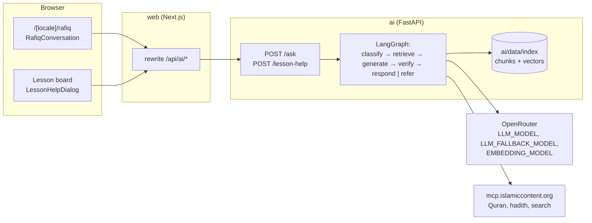

# Architecture

```
web/       Next.js (App Router, TypeScript, Tailwind, next-intl): the product, in Arabic (RTL) and English (LTR)
ai/        FastAPI + LangGraph (Python): Rafiq
content/   Lessons, sources, the stored source corpus (data, not code)
eval/      Rafiq's reliability cases, runner and results
docs/      This file, RELIABILITY, EVALUATION, SOURCES, CURRICULUM, COVERAGE, MCP_TOOLS
```

The browser talks only to the web app. The web app forwards `/api/ai/*` to the AI service through a same-origin rewrite (`web/next.config.ts`, `AI_SERVICE_URL`), so provider keys never leave the server side. Sections are switched on in `web/src/config/features.ts`; navigation shows only the sections that are on.

## Rafiq



### The AI service (`ai/`)

| Module | Responsibility |
|---|---|
| `app/main.py` | Builds the services at start-up: index, embedder, MCP client, chat models, Rafiq, rate limiter. |
| `app/api.py` | `POST /ask` and `POST /lesson-help`: validation, per-IP rate limit, error shapes. Nothing about a question is logged. |
| `app/rafiq/graph.py` | The LangGraph graph and its nodes. |
| `app/rafiq/policy.py` | The reliability levels A–D as code. |
| `app/languages.py` | The answer languages as one table: direction, QuranEnc translation, HadeethEnc code, and whether the local books are in it. |
| `app/rafiq/draft.py` | Parses a draft into paragraphs, list items, sentences and blocks, reading markers in any common style. |
| `app/rafiq/check.py` | Verification by code, with a category for each problem: markers, placeholders, copied sacred text. |
| `app/rafiq/repair.py` | Deterministic repairs after the retry, and the finishing every answer gets: the verses and hadiths it relies on shown, at most two. |
| `app/rafiq/compose.py` | Turns the checked draft into blocks, putting verbatim verses and hadiths in place of placeholders, and numbers the sources. |
| `app/rafiq/prompts/` | The prompts, one file each, in English. |
| `app/rafiq/schemas.py` | Pydantic models for every model reply and for the API. |
| `app/retrieval/` | Hybrid search over the local index, the hadith catalogue, the MCP client and its parsers, and the term pairs. |
| `app/llm.py` | OpenRouter chat (JSON, validation, retry, fallback, cooldown on 429) and embeddings. |
| `app/ingest.py` | Builds `ai/data/index/` from `content/`. |

**The index is committed.** `uv run python -m app.ingest` reads the corpus from `content/`:

- the lesson books (`content/corpus/books/`), split into pieces of about 800 characters at paragraph and subheading boundaries;
- TerminologyEnc terms;
- HadeethEnc catalogue titles;
- the fetched hadiths and verses the lessons reference (`content/fetched/`).

Each chunk carries `lang`, `type`, `sourceId`, `title`, `reference`, `url`, `publisher` and the `lessonIds` it covers. The ingest writes `chunks.jsonl`, `vectors.npy` (float16) and `meta.json`. Embeddings are cached by content hash, so a rebuild embeds only what changed. Search runs in memory with numpy: there is no vector database and no heavy native dependency, so the service fits a serverless function.

**The response** has the same shape for both endpoints:

```json
{
  "language": "ar | en | ur | bn | fr",
  "level": "A | B | C | D | null",
  "referred": false,
  "kind": "answer | referral | chat | clarify | danger",
  "opening": "A kind line with no religious statement, or null",
  "blocks": [
    { "type": "text", "text": "… [1]" },
    { "type": "quran", "n": 2, "ref": "2:256", "surah": 2, "ayah": 256, "surahName": "…", "arabic": "…",
      "translation": "…", "translationLanguage": "en", "translationKey": "english_saheeh",
      "translationName": "…", "translationVersion": "1.1.2", "url": "…" },
    { "type": "hadith", "n": 3, "id": 3064, "title": "…", "arabic": "…", "text": "…", "textLanguage": "en",
      "grade": "…", "attribution": "…", "explanation": null, "url": "…" }
  ],
  "sources": [{ "n": 1, "sourceId": "…", "title": "…", "reference": "…", "url": "…", "publisher": "…" }],
  "followUp": "One line that keeps the conversation going, or null",
  "referral": { "reason": "fatwa | personalCase | disputed | noSource | noEvidence | verification | distress | danger | offTopic | smalltalk",
                "links": ["/talk-to-a-specialist"], "centers": ["moia-1933", "…"] },
  "laterLessonId": "2.4",
  "languageFallback": false
}
```

- `/ask` takes `{question, locale, reachedLessonIds?, history?}`. `history` holds at most 8 turns, and `reachedLessonIds` are the lessons the learner completed.
- `referral.centers` are ids in `content/referral-centers.json`; the page renders the bodies from that file (the ingest copies the ids to `ai/data/index/referral-centers.json`).
- `/lesson-help` takes `{lessonId, cardId, lineText, mode: simpler | example | question, question?, locale}`. It searches the lesson's own sources first. The lesson line is context for the answer, never one of its sources.

How each answer is checked is described in `docs/RELIABILITY.md`; how that is measured is in `docs/EVALUATION.md`.

### The web side (`web/`)

| File | Responsibility |
|---|---|
| `src/lib/rafiq/answer.ts` | The response schema (zod), `postToRafiq` (answer, rate-limited, unavailable or error), and the client guard that turns an unsourced reply into a referral. |
| `src/lib/rafiq/ask.ts`, `lesson-help.ts` | Typed clients for the two endpoints. |
| `src/app/[locale]/rafiq/page.tsx` | The page, behind the `rafiq` flag. It passes lesson titles and links so that a later lesson can be named, and the lessons of the road in order for "continue your road". |
| `src/components/rafiq/rafiq-conversation.tsx` | The conversation between the learner and Rafiq, kept on the device per language (`src/lib/rafiq/memory.ts`), restored on return and cleared by "Start again". Each question carries the last 8 turns. Rafiq's pose follows each reply: thinking while waiting, pointing at a cited answer, happy in small talk, listening when he asks back, encouraging at a referral or an error. |
| `src/components/rafiq/rafiq-memory.tsx` | The greeting and next lesson (built from the message files), the optional name prompt (asked once, skippable), and "What Rafiq remembers" with a clear-everything control. |
| `src/lib/device-store.ts` | Values kept in this browser only, shared by every component that shows them. |
| `src/components/rafiq/answer-view.tsx` | One reply, with the `lang` and `dir` of its language, by kind: the opening, the cited text and lists with `[n]` markers linked to source cards (labelled "Generated explanation"), the referral card, the specialist card, the later lesson, the follow-up and the AI disclosure. |
| `src/components/specialists/*`, `src/lib/referral/*` | The specialist card and the specialist page, rendered from `content/referral-centers.json` (provided once by the locale layout); the chosen city, kept on the device. |
| `src/components/rafiq/answer-blocks.tsx` | The verse block (Arabic in the Quran face, surah and ayah, the published translation with its name and version) and the hadith block (Arabic, published translation, grade, attribution, HadeethEnc's explanation in extractive answers). Long texts collapse with "show all"; nothing is trimmed. |
| `src/lib/rafiq/languages.ts`, `src/lib/answer-fonts.ts`, `messages/answer-languages.json` | The answer languages: direction and face (Urdu and Bengali faces load only with such an answer), and the referral, disclosure and small-talk texts in Urdu, Bengali and French (awaiting native review). |
| `src/components/rafiq/source-cards.tsx`, `referral-card.tsx`, `rafiq-stage.tsx` | Source cards, each with links to the source and to its entry on `/sources`; the referral card for each reason; Rafiq in his own light, which breathes while he thinks (off under `prefers-reduced-motion`). |
| `src/components/learn/board/lesson-help-dialog.tsx` | "I didn't understand this line" on the lesson board, answered through `/lesson-help` and shown with the same `AnswerView`. |

The rewrite allows 90 seconds per request (`experimental.proxyTimeout`): every answer is verified before it is sent, and free model tiers can be slow.
