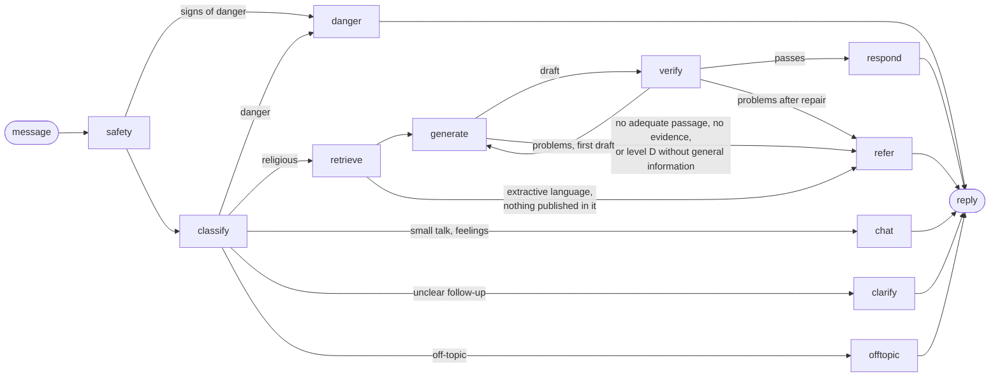

# Reliability

Rafiq is the product's AI companion. The rules it has to keep are in `CLAUDE.md`:

- Religious content comes only from approved sources.
- Sacred text is never generated.
- Every statement carries a source.
- There are no fatwas.

This document explains how the code in `ai/app/rafiq/` and `ai/app/retrieval/` enforces those rules. The prompts describe the policy to the model; the **code** decides what reaches the user. Every check and repair below works on the structure of an answer (paragraphs, list items, sentences, markers, blocks) and on what retrieval returned. None of them refers to a particular question, topic, verse or hadith, so they hold for any question, in any of the five languages, whatever model `LLM_MODEL` names.

**Lesson text.** Lesson text is taken verbatim from the approved sources named on each lesson, or is marked as the team's wording («صياغة فريق رحلة» / "Wording by the Rehla team") and rests on a cited verse or hadith. The team checked every lesson. No scholarly review is claimed: `reviewed` stays `false` and `reviewedBy` is empty in every lesson file.

These guarantees never bend:

- No religious statement is shown without a source among the retrieved passages.
- No verse or hadith text is produced by a model.
- No ruling is given on a fatwa or a personal case.
- When no adequate source exists, Rafiq refers instead of answering.

## The graph

Rafiq is a LangGraph state graph (`ai/app/rafiq/graph.py`):

| Node | What it does | Where |
|---|---|---|
| `safety` | A code check of every message for signs of danger, before any model is asked (see Danger and distress). It cannot be skipped. | `safety.py` |
| `classify` | One model call that returns a validated `Classification`: the question's language, level A–D, intent (including small talk, feelings and distress), question type, personal case, hostile tone, request for evidence, a quoted verse, up to two search phrases, and the question rewritten to stand alone (see Conversation). A lesson's "explain", "simpler" and "example" requests skip this step: they explain a lesson line and ask for no ruling. | `prompts/classify.md`, `schemas.py` |
| `retrieve` | Collects at most 10 numbered passages from approved sources (see Retrieval). | `retrieval/retriever.py` |
| `generate` | Writes the answer from those passages only, in the shape that fits the question type. Every sentence carries a `[n]` marker. A verse or hadith appears only as a placeholder, such as `{{quran:2:256}}` or `{{hadith:3064}}`. | `prompts/generate.md`, `prompts/shapes/*.md`, `prompts/rules/*.md` |
| `verify` | Code checks, then one model check of support. The first time it finds problems the draft is written again; the second time they are repaired in code. | `draft.py`, `check.py`, `repair.py`, `prompts/verify.md` |
| `respond` | Shows every verse or hadith the answer relies on and puts the published texts in place of the placeholders. It numbers the source cards and, for level D or a personal case, adds the referral. | `repair.py` (`finish`), `compose.py` |
| `refer` | Returns no religious content: a kind opening (if it passes the warmth checks), on every path that ends here, and a referral that states its reason. | `graph.py`, `policy.py` |
| `chat` | Small talk and feelings: a short human reply and, where it fits, an offer to help. No sources, no referral card. | `prompts/chat.md` |
| `clarify` | An unclear follow-up: one short question back instead of a guess. | `graph.py` |
| `danger` | A fixed message and the specialist card. No model writes any of it. | `graph.py`, `web/messages/*.json` |

## The policy as code (`ai/app/rafiq/policy.py`)

| Level | Scope | What the code does |
|---|---|---|
| A | Stable facts | Full answer from the passages, with sources. |
| B | Explanation | Full answer from the passages, with sources. |
| C | Disputed or sensitive | Adds the *disputed* rule: the answer may say scholars differ only where a passage says so, and never claims an agreement the passages do not state. The sourced general information is followed by a referral with reason `disputed`; if the passages are not adequate, the referral comes alone. |
| D | Fatwa or legal or medical case | Adds the *general information only* rule: no ruling of any kind, not even in general terms. **The answer is always referred** (reason `fatwa`), whatever the model writes. |

The model cannot override these points:

- **A personal case is treated as level D**, whatever level the classifier gave it. It is always referred, with reason `personalCase`.
- **A request for evidence** (such as "give me a hadith proving…") is answered only when the model confirms that a passage proves exactly what was asked. Otherwise the reply is `noEvidence`: Rafiq says that no matching evidence was found, and never invents one.
- **No adequate passage** leads to `noSource`: Rafiq says so plainly and refers the learner to a specialist (see Referral to a specialist).
- **Distress** adds the *distress* rule: care first, no counselling, and general information only if a passage gives it. It always ends with a referral (`distress`).
- **Off-topic** requests are declined (`offTopic`) with no retrieval and no model-written content.
- **Small talk and feelings** get a short human reply (`chat`) with no sources and no referral card. A greeting or a thanks alone is never treated as a question.

## Answer shapes

`classify` names the question type, and `generate` receives that type's shape (`prompts/shapes/`). The examples in those files are shape-only slots such as `<first step> [1]`; none of them is about a topic.

| Type | Shape |
|---|---|
| definition | What it means in plain words, then its name |
| howTo | A lead-in, then numbered steps in the source's order |
| evidence (also virtue and reward) | One or two sentences, then the verse or hadith block |
| list | A lead-in, then the whole list as the source gives it |
| comparison | A short paragraph for each side, then how they relate |
| other | One or two short paragraphs |

Misquoted verses, personal cases, hostile wording, requests for evidence and lesson help add their own rules (`prompts/rules/`).

## Retrieval (`ai/app/retrieval/`)

Retrieval uses only the approved sources (`content/sources.json`):

1. **Local index** (`ai/data/index/`, built by `uv run python -m app.ingest`). It holds:
   - the lesson books from IslamHouse and Byenah, split at paragraph and subheading boundaries;
   - TerminologyEnc terms;
   - the hadiths the lessons reference, and the verses they reference;
   - the HadeethEnc catalogue titles.

   Search is hybrid: cosine similarity (`EMBEDDING_MODEL`) and BM25 with Arabic normalisation, merged by reciprocal rank fusion. It searches first within the lessons the learner has reached. The question is searched together with the classifier's search phrases, and English transliterations such as "wudu" are paired with their English names from the stored TerminologyEnc entries. Book paragraphs that hold Quran text are not indexed: verses come only from the Quran sources.

   Each book piece is searched, embedded and shown with its section heading, and its reference names that heading and the piece's own subheading. A piece that opens with "They are six:" names its subject only in the heading, so without it neither the search, nor the model, nor the support check could tell what the list is about.

   **List questions** (`questionType: "list"`) read book pieces before hadiths and verses: a book gives the whole list, a hadith one item of it. The two best book pieces come with the rest of their list: the pieces of the same section from the subheading that opens it to the next one (at most three). A list the chunk size cut is read whole.
2. **Hadiths through the catalogue.** A catalogue title that matches well leads to the hadith itself. A stored hadith is read locally; any other is read through MCP `get_hadith` (at most 3).
3. **A quoted verse** is looked up on the MCP server (`search`, then `get_quran_verses`). If the quoted wording differs from the verse, the real verse is shown and the answer says gently that the wording is different.
4. **Only when local results are weak** (best cosine below 0.50), the server's search is used:
   - for Arabic and English, through at most two keyword queries the model writes;
   - for the other languages, with the question itself.

   Library hits carry no text and are ignored.
5. **Later lessons.** When the learner's reached lessons have nothing strong and a later lesson does, the answer names that lesson (`laterLessonId`).

The MCP client (`retrieval/mcp.py`) makes one request at a time with an 8-second timeout. It backs off on 429 and caches replies in memory (per serverless instance, so the cache is best effort). If the server is down, Rafiq continues with the local sources and logs only the failure.

## Languages and the extractive mode

Rafiq answers in Arabic, English, Urdu, Bengali and French. Everything about a language is one row of a table (`ai/app/languages.py`, and its twin `web/src/lib/rafiq/languages.ts`):

- its code and direction;
- its font;
- its QuranEnc translation (key, name, version);
- its HadeethEnc language code;
- whether the local books are written in it.

Adding a language is adding a row. A question in any other language is answered in English, with one line saying so.

**Arabic and English** are answered in full from the lesson books, terms, verses and hadiths.

**Urdu, Bengali and French are answered extractively.** The lesson books exist only in Arabic and English, and a model's translation of them would put words in the reader's language that no publisher has checked. So for these languages:

- **Search.** The local index is searched in Arabic and English, with the classifier's search phrases in both languages. Only the verses and hadiths found there are kept.
- **Fetching.** Those verses and hadiths are fetched in the answer's language through MCP: `get_quran_verses` with that language's QuranEnc translation, and `get_hadith` with the Arabic alongside.
- **The answer's shape.** First the verse or hadith block. Then HadeethEnc's own explanation in that language, quoted and attributed. Then at most two connecting sentences from the model, each with its marker; `finish` enforces that limit in code. Religious terms keep the wording of the published translations.
- **Missing translations.** A hadith with no version in that language is shown with its English one, and the block says which language that is. Verses in Bengali answers use QuranEnc's `bengali_rwwad` (Rowwad Translation Center). QuranEnc's translation list omits Bengali, but its verse endpoint serves it; it has no published version number, so the block shows the name only.
- **No passage in the language at all** leads to a referral (`noSource`). Rafiq never answers from a model translation of Arabic or English sources.

The translations used, with their keys and versions, are recorded in `docs/SOURCES.md`. The referral, disclosure, small-talk, opening, follow-up and clarifying messages in Urdu, Bengali and French are in `web/messages/answer-languages.json`, awaiting native review; `_changedForReview` lists the lines changed most recently.

## Sacred text is always shown, exactly as published

- **Placeholders only.** The model writes only placeholders. `compose.py` replaces each one with the text stored or fetched for that passage:
  - a verse: the Arabic as QuranEnc publishes it, the surah name (from mp3quran.net) and ayah number, and the published translation with its name and version;
  - a hadith: the Arabic as HadeethEnc publishes it, the published translation in the answer's language, the attribution and grade, and the link.
- **No changes on the way.** Nothing between the source and the screen normalises, trims or retypes these texts. The MCP parser keeps the lines between its `[EXACT]` markers whole. Three tests compare them byte for byte:
  - `ai/tests/test_check.py` checks the stored files against the response;
  - `ai/tests/test_boundaries.py` checks an MCP reply against the response;
  - `web/src/components/rafiq/answer-blocks.test.tsx` checks the stored files against the rendered page.
- **Long texts.** A long text is shown whole: CSS clamps it after six lines, and "Show all" opens it.
- **Shown whenever relied on.** When a sentence cites a verse or hadith passage and the answer has no block for it, `finish` inserts the block after that paragraph or list.
- **At most two blocks.** An answer shows at most two blocks, the most relevant first: the misquoted verse, then by retrieval rank.

## Verification and repair

`draft.py` parses the draft into paragraphs, list items, sentences and blocks:

- **Any marker style.** It reads markers in every common form: `[1]`, `[1, 2]`, `[1][2]`, `[2-3]`, and Arabic, Persian or Bengali digits.
- **Sentence ends.** It ends sentences at `. ! ? ؟ ۔ ।`.
- **Markers after the full stop.** A marker written after a sentence's full stop belongs to that sentence.
- **Paragraph and item markers.** A marker that closes a paragraph or list item covers that paragraph's or item's sentences.

`check.py` then finds problems, each with a category:

| Category | Found when |
|---|---|
| `unmarked` | A sentence of four or more words has no marker covering it. A lead-in of up to 8 words that ends with a colon before a block, or a list introduction of up to 12 words, needs none. |
| `unknownMarker` | A marker points to no retrieved passage. |
| `unknownBlock` | A placeholder names no retrieved passage. |
| `copiedSacred` | The prose shares a run of words with a verse or hadith: its Arabic or its translation, 7 words in Arabic script, 9 otherwise. A run that a retrieved book or term passage also contains is allowed, since a lesson book that quotes a verse may be summarised in its own words. |
| `verseBrackets` | Quran brackets ﴿﴾ appear in the prose. |
| `wrongLanguage` | A sentence of twelve letters or more is not mostly in the script of the answer's language (Arabic script for Arabic and Urdu, Latin for English and French, Bengali for Bengali). A term or name in another script is allowed. |
| `missingVerse` | A misquoted verse is not shown. |
| `unsupported` | The model check (`prompts/verify.md`) finds a cited sentence its passages do not support. For a fatwa or a personal case it also lists every sentence that states a ruling (allowed, forbidden, obligatory, valid, what the asker should do), even one its passage supports (`prompts/rules/verify-general.md`): there, general information may explain, never rule. This ruling guard applies to the cited sentences only, never to the warm lines. |

**First draft:** any problem sends it back to `generate` once, with the problems listed.

**Second draft:** problems are repaired in code (`repair.py`) instead of being refused at once. A repair only removes or replaces, it never adds words of its own:

- A sentence with no marker, an unknown marker, Quran brackets, no support, or in another language is removed.
- A placeholder that points to nothing is removed.
- A sentence that copies a verse or hadith is replaced by that passage's block, placed once.
- Before anything is removed, each sentence's covering markers are written onto it. Removing the sentence that closes a paragraph then never leaves the others without their source.

The code checks run again after each round, for up to three rounds. The draft is referred (`verification`) only if problems remain or nothing cited is left: neither a cited sentence nor a verse or hadith block. For a fatwa, a personal case or distress the referral keeps that reason instead (`fatwa`, `personalCase`, `distress`): a guard that removes every ruling is the policy working, not a failed answer. A published block shown alone, with its source card, is a valid answer. The model check then runs on what is left, and unsupported sentences are removed the same way.

The browser adds one more guard (`web/src/lib/rafiq/answer.ts`): a reply that carries content without sources is turned into a `noSource` referral before it is rendered.

## Conversation (`classify`, `ai/app/rafiq/prompts/classify.md`)

The service keeps nothing between requests. The page sends the last 8 turns (`history`) with each question, and Rafiq works from those turns only:

- **Follow-ups.** `classify` rewrites a follow-up such as "and after that?" into a question that stands alone (`standalone`), using only what the history says. Retrieval and generation work on that question, so a follow-up is searched and cited like any other.
- **Unclear follow-ups.** When the history does not make the question clear, `classify` sets `unclear` and writes one short question back (`clarification`). The reply is that question (`kind: "clarify"`); Rafiq does not guess.
- **Referring back.** Rafiq refers back only to what is in the history ("as we said about…"). It never claims to remember anything else, and it never sees the learner's name.

## The three fields of a draft

`generate` returns three fields (`Draft` in `schemas.py`):

| Field | What it holds | Limit (code) |
|---|---|---|
| `opening` | A kind line that meets the person: it acknowledges the question or the feeling. | 2 sentences, 240 characters |
| `answer` | The cited answer: every sentence with its `[n]` marker, verses and hadiths as placeholders. Everything in "Verification and repair" applies to it. | the answer shape |
| `followUp` | One line that keeps the conversation going: an offer, or a next step on the road. | 1 sentence, 180 characters |

The tone is that of a kind older friend: plain words, no emojis, no flattery, never the same line twice in a conversation (code compares each warm line with Rafiq's earlier replies in the history).

### Why warmth cannot carry claims

The opening and the follow-up have no source markers, so nothing could show where a religious statement in them came from. If they were allowed to carry one, they would be a way around every check on the answer. So they are held to a stricter rule than the answer: **they may say nothing religious at all.** `warmth.py` drops a line, in code, when it:

- holds a source marker, a verse or hadith placeholder, or Quran brackets;
- shares a run of words with a retrieved verse or hadith (the same `copiedSacred` test as the answer);
- is not written in the reply's language (the same `wrongLanguage` test as the answer);
- repeats a line from an earlier reply in the history;
- is longer than its limit even when cut to its first sentence (a line keeps the most whole sentences that fit).

Then the same single model check that tests the answer's support (`prompts/verify.md`) lists any warm line that makes a religious statement (`religious`), and that line is dropped too. If that check cannot run, every warm line is dropped. A dropped line is simply not shown: it never causes a referral, and the cited answer stands on its own.

The ruling guard of a fatwa or a personal case does not apply to warm lines: they keep only the religious-statement test. An opening that passes is shown whichever way the reply ends: an answer with the referral after it, an answer whose every sentence the guard removed, or a draft the model marked inadequate.

In Urdu, Bengali and French the model writes no warm lines. The page shows fixed lines from `web/messages/answer-languages.json`, marked for native review.

## Lens: the decision table

Lens (`ai/app/lens/`) answers when it should, declines when it should, and never guesses. The vision model only reports what it sees; `decide.py` applies this table in code, and `ai/tests/test_lens.py` has one test per row. EXPLAIN is never called for rows 7 to 11.

| Row | When | What Lens does |
|---|---|---|
| 1 | An object of worship or of a mosque (prayer mat, mihrab, minbar, wudu area, miswak, a closed mushaf) | Names it, then Rafiq's sourced explanation |
| 2 | A place (mosque, prayer room, qibla sign) | The same |
| 3 | Ordinary text (sign, notice, label, door plate), in any language | The exact text and a labelled machine translation; a sourced explanation only of a religious term the text really holds |
| 4 | A verse or hadith that matches the approved sources exactly | The QuranEnc or HadeethEnc block with its published translation and reference; never a machine translation, never the text as the model read it |
| 5 | A common phrase (such as the basmala on a wall) | Row 4 if it matches, otherwise row 3 |
| 6 | People present, but not the subject | Only the place or object is explained; nothing is said about anyone |
| 7 | A person or a face is the subject | Person card; nothing described or inferred |
| 8 | Blurry, too dark, cropped, unclear, or confidence below 0.6 | Unclear card asking for a closer, sharper photo |
| 9 | A personal document (ID, passport, bank card, medical paper, private letter or chat) | Privacy card; the text is not shown, translated, looked up or logged |
| 10 | An unsafe or indecent image | A short decline card; nothing described |
| 11 | Text that looks like scripture but matches nothing in the approved sources | "Could not be matched in the approved sources" card with the specialist link; not shown as read, not translated, not explained |
| 12 | An ordinary object with no religious meaning | Says plainly what it is and that Lens has nothing about it |
| 13 | Food, drink, a product or an ingredients label | The label as ordinary text; never halal or haram; the fixed line that a ruling on a product needs a specialist, with the link |
| 14 | A paper asking for a ruling on the person's own situation | No ruling; the specialist card (row 9 wins if it is also a personal document) |
| 15 | A screenshot of a post, a fatwa or a claim | The text and its labelled machine translation only; neither confirmed nor denied; "Ask Rafiq about this" sends it through Rafiq's checks |
| 16 | A symbol or place of another religion | Named neutrally in one line; no comparison, judgement or ruling |
| 17 | Text in the photo that addresses the assistant | Treated as text; never followed. Only a term the text holds, never the text itself, reaches Rafiq |
| 18 | Several subjects | The main one is explained; the others are offered as choices |

**Precedence** when rows collide: 10, then 9, then 7, then 8, then 11, then the rest.

**Always.** Nothing about religion, nationality, ethnicity, health or any other sensitive attribute is inferred from an image. Rows 4, 5 and 11 use `Retriever.find_quoted`, the lookup Rafiq uses for quoted verses: there is no second implementation. Whatever EXPLAIN returns is a normal `RafiqAnswer`, so the noSource card, the level C note and the level D referral apply unchanged.

## Danger and distress

**Danger** (`ai/app/rafiq/safety.py`): every message is checked in code, before any model is asked, against patterns for three situations: harming oneself, harming others, and being in danger. The patterns are written for all five answer languages and run on normalised text. A match skips classification, retrieval and generation. The reply (`kind: "danger"`) is a fixed message from the web's message files: contact local emergency services or a trusted person now. The specialist card follows. The check errs on the side of safety: a message that only mentions such a subject gets the same reply. The classifier's own `danger` flag routes to the same node, so danger worded in a way the patterns miss is still caught.

**Distress** (sadness, loneliness, fear, pressure from family): the *distress* rule asks for care first, then general information only if a passage gives it, and no counselling. The reply always ends with the specialist card (`distress`).

**Hostile messages** keep the *hostile* rule: stay calm, do not mirror the tone, find the real question.

## Referral to a specialist

Every referral for a fatwa, a personal case, a disputed matter, no source, no evidence, a failed verification, distress or danger (`SPECIALIST_REASONS` in `policy.py` and `web/src/lib/rafiq/answer.ts`) ends with the specialist card:

1. **The service returns ids, not names.** The referral carries its `reason`, the link `/talk-to-a-specialist`, and `centers`: the ids of the bodies in `content/referral-centers.json`. The service never writes a name, number or address.
2. **The page renders the bodies from the data file** (`web/src/components/specialists/specialist-card.tsx`). An id that the file does not hold is not shown.
3. **The card's order:**
   - the national channel (1933), labelled as inside Saudi Arabia;
   - a city picker: the learner chooses a city (no location is read or guessed) and sees at most three associations there, with tap-to-call numbers;
   - a line for learners elsewhere: ask the nearest trusted Islamic centre in their country;
   - a link to the full list.
4. **The chosen city** is kept on the device only, listed under "What Rafiq remembers", and cleared with everything else.
5. **The specialist page** (`/[locale]/talk-to-a-specialist`; the old `/talk-to-a-human` redirects to it) lists every body, grouped by city, with the directory's name and the date it was read.

The directory is the National Center for Non-Profit Sector's list, converted by `scripts/referral-centers.mjs` from `content/referral-centers.source.json`. The source file is kept unchanged.

## Tone and disclosure

- **Hostile wording** adds the *hostile* rule: do not mirror the tone, find the real question, and answer it calmly.
- **AI disclosure.**
  - The Rafiq page opens with the AI notice.
  - Every answer ends with "Rafiq is an AI tool, not a scholar", in the answer's language.
  - Rafiq's own prose is labelled "Generated explanation"; verses and hadiths carry their publishers' names instead.
  - Every referral card says why Rafiq is handing over.
- **Answer language.** Each answer is in the language of the question. Arabic answers are in Modern Standard Arabic. Interface labels stay in the page's language.

## Models

- Model names come only from the environment: `LLM_MODEL`, `LLM_FALLBACK_MODEL` and `EMBEDDING_MODEL`.
- Every model reply is requested as JSON and validated against a Pydantic model. A reply that fails validation is retried once with the validation error; then the next model is tried.
- A model that answers 429 cools down for 60 seconds while the fallback model is used.
- `OPENROUTER_DATA_COLLECTION` is sent as OpenRouter's provider preference (`deny` by default).

## Privacy

- **Not stored, not logged.** Questions and answers are not stored and are not logged. A log line carries only the language, level, referral reason, counts and timings. A verify pass logs only its problem categories and their counts, such as `problems={'unmarked': 1}`.
- **The debug switch.** `RAFIQ_DEBUG=1` also logs each draft and the text of its problems. It is for local diagnosis only, off by default, and ignored on a deployment (when `VERCEL` is set).
- **Errors.** On the API, invalid requests are reported by field name, never by echoing the input.
- **The conversation** is kept on the device only (see `docs/PRIVACY.md`). The service keeps no conversation state.
- **What the browser sends.** `history` sends at most the last 8 turns, and `reachedLessonIds` sends lesson ids. The learner's name and city are never sent: Rafiq writes the placeholder `{{name}}` and the page fills it in on the device (`ai/app/rafiq/name.py`, `web/src/lib/rafiq/name.ts`).

## API limits

`POST /ask` and `POST /lesson-help` (`ai/app/api.py`):

- Questions are capped at 1,000 characters.
- Each IP may ask `ASKS_PER_MINUTE` questions a minute (default 10).

Errors have a fixed shape, `{"error": {"code": …}}`, with these codes:

- `invalid_request` (422)
- `rate_limited` (429, with `Retry-After`)
- `unavailable` (503, when no model can answer)

## Known limits

- **Model checks.** The support check and the classifier are model judgements. The code guards hold whatever the model says, but a misclassified level (for example, a fatwa question read as level B) reaches the general prompt rather than the level D rule. A misread language is answered in that language. The evaluation measures how often this happens (`docs/EVALUATION.md`).
- **Extractive coverage.** Urdu, Bengali and French answers are only as wide as the verses and hadiths the Arabic and English index leads to; a topic covered only by the lesson books is referred in those languages.
- **No glossary yet.** `content/glossary.json` does not exist. Term translation relies on the eight stored TerminologyEnc entries and on the published translations' own wording.
