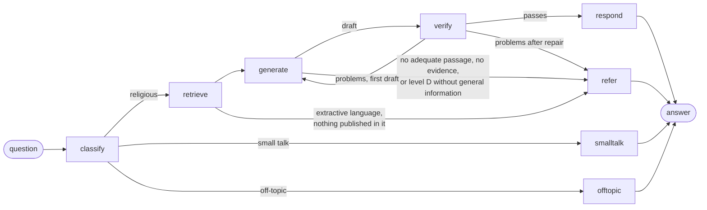

# Reliability

Rafiq is the product's AI companion. The rules it has to keep are in `CLAUDE.md`:

- Religious content comes only from approved sources.
- Sacred text is never generated.
- Every statement carries a source.
- There are no fatwas.

This document explains how the code in `ai/app/rafiq/` and `ai/app/retrieval/` enforces those rules. The prompts describe the policy to the model; the **code** decides what reaches the user. Every check and repair below works on the structure of an answer (paragraphs, list items, sentences, markers, blocks) and on what retrieval returned. None of them refers to a particular question, topic, verse or hadith, so they hold for any question, in any of the five languages, whatever model `LLM_MODEL` names.

These guarantees never bend:

- No religious statement is shown without a source among the retrieved passages.
- No verse or hadith text is produced by a model.
- No ruling is given on a fatwa or a personal case.
- When no adequate source exists, Rafiq refers instead of answering.

## The graph

Rafiq is a LangGraph state graph (`ai/app/rafiq/graph.py`):

| Node | What it does | Where |
|---|---|---|
| `classify` | One model call that returns a validated `Classification`: the question's language, level A–D, intent, question type, personal case, hostile tone, request for evidence, a quoted verse, and up to two search phrases. A lesson's "simpler" and "example" requests skip this step: they explain a lesson line and ask for no ruling. | `prompts/classify.md`, `schemas.py` |
| `retrieve` | Collects at most 10 numbered passages from approved sources (see Retrieval). | `retrieval/retriever.py` |
| `generate` | Writes the answer from those passages only, in the shape that fits the question type. Every sentence carries a `[n]` marker. A verse or hadith appears only as a placeholder, such as `{{quran:2:256}}` or `{{hadith:3064}}`. | `prompts/generate.md`, `prompts/shapes/*.md`, `prompts/rules/*.md` |
| `verify` | Code checks, then one model check of support. The first time it finds problems the draft is written again; the second time they are repaired in code. | `draft.py`, `check.py`, `repair.py`, `prompts/verify.md` |
| `respond` | Shows every verse or hadith the answer relies on and puts the published texts in place of the placeholders. It numbers the source cards and, for level D or a personal case, adds the referral. | `repair.py` (`finish`), `compose.py` |
| `refer` | Returns no religious content: only a referral that states its reason. | `graph.py`, `policy.py` |

## The policy as code (`ai/app/rafiq/policy.py`)

| Level | Scope | What the code does |
|---|---|---|
| A | Stable facts | Full answer from the passages, with sources. |
| B | Explanation | Full answer from the passages, with sources. |
| C | Disputed or sensitive | Adds the *disputed* rule: the answer may say scholars differ only where a passage says so, and never claims an agreement the passages do not state. If the passages are not adequate, the reply is a referral with reason `disputed`. |
| D | Fatwa or legal or medical case | Adds the *general information only* rule: no ruling of any kind, not even in general terms. **The answer is always referred** (reason `fatwa`), whatever the model writes. |

The model cannot override these points:

- **A personal case is treated as level D**, whatever level the classifier gave it. It is always referred, with reason `personalCase`.
- **A request for evidence** (such as "give me a hadith proving…") is answered only when the model confirms that a passage proves exactly what was asked. Otherwise the reply is `noEvidence`: Rafiq says that no matching evidence was found, and never invents one.
- **No adequate passage** leads to `noSource`: Rafiq says so plainly and refers the user to a person (`/talk-to-a-human`, which lists the centres in `content/referral-centers.json`).
- **Off-topic** requests are declined (`offTopic`) with no retrieval and no model-written content.
- **Small talk** gets a fixed reply from the UI's message files. The model writes none of it.

## Answer shapes

`classify` names the question type, and `generate` receives that type's shape (`prompts/shapes/`). The examples in those files are shape-only slots such as `<first step> [1]`; none of them is about a topic.

| Type | Shape |
|---|---|
| definition | What it means in plain words, then its name |
| howTo | A lead-in, then numbered steps in the source's order |
| evidence (also virtue and reward) | One or two sentences, then the verse or hadith block |
| list | A lead-in, then the whole list as the source gives it |
| comparison | A short paragraph for each side, then how they relate |
| other | One or two short paragraphs |

Misquoted verses, personal cases, hostile wording, requests for evidence and lesson help add their own rules (`prompts/rules/`).

## Retrieval (`ai/app/retrieval/`)

Retrieval uses only the approved sources (`content/sources.json`):

1. **Local index** (`ai/data/index/`, built by `uv run python -m app.ingest`). It holds:
   - the lesson books from IslamHouse and Byenah, split at paragraph and subheading boundaries;
   - TerminologyEnc terms;
   - the hadiths the lessons reference, and the verses they reference;
   - the HadeethEnc catalogue titles.

   Search is hybrid: cosine similarity (`EMBEDDING_MODEL`) and BM25 with Arabic normalisation, merged by reciprocal rank fusion. It searches first within the lessons the learner has reached. The question is searched together with the classifier's search phrases, and English transliterations such as "wudu" are paired with their English names from the stored TerminologyEnc entries. Book paragraphs that hold Quran text are not indexed: verses come only from the Quran sources.
2. **Hadiths through the catalogue.** A catalogue title that matches well leads to the hadith itself. A stored hadith is read locally; any other is read through MCP `get_hadith` (at most 3).
3. **A quoted verse** is looked up on the MCP server (`search`, then `get_quran_verses`). If the quoted wording differs from the verse, the real verse is shown and the answer says gently that the wording is different.
4. **Only when local results are weak** (best cosine below 0.50), the server's search is used:
   - for Arabic and English, through at most two keyword queries the model writes;
   - for the other languages, with the question itself.

   Library hits carry no text and are ignored.
5. **Later lessons.** When the learner's reached lessons have nothing strong and a later lesson does, the answer names that lesson (`laterLessonId`).

The MCP client (`retrieval/mcp.py`) makes one request at a time with an 8-second timeout. It backs off on 429 and caches replies in memory. If the server is down, Rafiq continues with the local sources and logs only the failure.

## Languages and the extractive mode

Rafiq answers in Arabic, English, Urdu, Bengali and French. Everything about a language is one row of a table (`ai/app/languages.py`, and its twin `web/src/lib/rafiq/languages.ts`):

- its code and direction;
- its font;
- its QuranEnc translation (key, name, version);
- its HadeethEnc language code;
- whether the local books are written in it.

Adding a language is adding a row. A question in any other language is answered in English, with one line saying so.

**Arabic and English** are answered in full from the lesson books, terms, verses and hadiths.

**Urdu, Bengali and French are answered extractively.** The lesson books exist only in Arabic and English, and a model's translation of them would put words in the reader's language that no publisher has checked. So for these languages:

- **Search.** The local index is searched in Arabic and English, with the classifier's search phrases in both languages. Only the verses and hadiths found there are kept.
- **Fetching.** Those verses and hadiths are fetched in the answer's language through MCP: `get_quran_verses` with that language's QuranEnc translation, and `get_hadith` with the Arabic alongside.
- **The answer's shape.** First the verse or hadith block. Then HadeethEnc's own explanation in that language, quoted and attributed. Then at most two connecting sentences from the model, each with its marker; `finish` enforces that limit in code. Religious terms keep the wording of the published translations.
- **Missing translations.** A hadith with no version in that language is shown with its English one, and the block says which language that is. QuranEnc has no Bengali translation, so a verse in a Bengali answer shows the English translation, labelled.
- **No passage in the language at all** leads to a referral (`noSource`). Rafiq never answers from a model translation of Arabic or English sources.

The translations used, with their keys and versions, are recorded in `docs/SOURCES.md`. The referral, disclosure and small-talk messages in Urdu, Bengali and French are in `web/messages/answer-languages.json`, marked as awaiting native review.

## Sacred text is always shown, exactly as published

- **Placeholders only.** The model writes only placeholders. `compose.py` replaces each one with the text stored or fetched for that passage:
  - a verse: the Arabic as QuranEnc publishes it, the surah name (from mp3quran.net) and ayah number, and the published translation with its name and version;
  - a hadith: the Arabic as HadeethEnc publishes it, the published translation in the answer's language, the attribution and grade, and the link.
- **No changes on the way.** Nothing between the source and the screen normalises, trims or retypes these texts. The MCP parser keeps the lines between its `[EXACT]` markers whole. Three tests compare them byte for byte:
  - `ai/tests/test_check.py` checks the stored files against the response;
  - `ai/tests/test_boundaries.py` checks an MCP reply against the response;
  - `web/src/components/rafiq/answer-blocks.test.tsx` checks the stored files against the rendered page.
- **Long texts.** A long text is shown whole: CSS clamps it after six lines, and "Show all" opens it.
- **Shown whenever relied on.** When a sentence cites a verse or hadith passage and the answer has no block for it, `finish` inserts the block after that paragraph or list.
- **At most two blocks.** An answer shows at most two blocks, the most relevant first: the misquoted verse, then by retrieval rank.

## Verification and repair

`draft.py` parses the draft into paragraphs, list items, sentences and blocks:

- **Any marker style.** It reads markers in every common form: `[1]`, `[1, 2]`, `[1][2]`, `[2-3]`, and Arabic, Persian or Bengali digits.
- **Sentence ends.** It ends sentences at `. ! ? ؟ ۔ ।`.
- **Markers after the full stop.** A marker written after a sentence's full stop belongs to that sentence.
- **Paragraph and item markers.** A marker that closes a paragraph or list item covers that paragraph's or item's sentences.

`check.py` then finds problems, each with a category:

| Category | Found when |
|---|---|
| `unmarked` | A sentence of four or more words has no marker covering it. A lead-in of up to 8 words that ends with a colon before a block, or a list introduction of up to 12 words, needs none. |
| `unknownMarker` | A marker points to no retrieved passage. |
| `unknownBlock` | A placeholder names no retrieved passage. |
| `copiedSacred` | The prose shares a run of words with a verse or hadith: its Arabic or its translation, 7 words in Arabic script, 9 otherwise. A run that a retrieved book or term passage also contains is allowed, since a lesson book that quotes a verse may be summarised in its own words. |
| `verseBrackets` | Quran brackets ﴿﴾ appear in the prose. |
| `missingVerse` | A misquoted verse is not shown. |
| `unsupported` | The model check (`prompts/verify.md`) finds a cited sentence its passages do not support. |

**First draft:** any problem sends it back to `generate` once, with the problems listed.

**Second draft:** problems are repaired in code (`repair.py`) instead of being refused at once. A repair only removes or replaces, it never adds words of its own:

- A sentence with no marker, an unknown marker, Quran brackets or no support is removed.
- A placeholder that points to nothing is removed.
- A sentence that copies a verse or hadith is replaced by that passage's block, placed once.
- Before anything is removed, each sentence's covering markers are written onto it. Removing the sentence that closes a paragraph then never leaves the others without their source.

The code checks run again after each round, for up to three rounds. The draft is referred (`verification`) only if problems remain or nothing cited is left: neither a cited sentence nor a verse or hadith block. A published block shown alone, with its source card, is a valid answer. The model check then runs on what is left, and unsupported sentences are removed the same way.

The browser adds one more guard (`web/src/lib/rafiq/answer.ts`): a reply that carries content without sources is turned into a `noSource` referral before it is rendered.

## Tone and disclosure

- **Hostile wording** adds the *hostile* rule: do not mirror the tone, find the real question, and answer it calmly.
- **AI disclosure.**
  - The Rafiq page opens with the AI notice.
  - Every answer ends with "Rafiq is an AI tool, not a scholar", in the answer's language.
  - Every referral card says why Rafiq is handing over.
- **Answer language.** Each answer is in the language of the question. Arabic answers are in Modern Standard Arabic. Interface labels stay in the page's language.

## Models

- Model names come only from the environment: `LLM_MODEL`, `LLM_FALLBACK_MODEL` and `EMBEDDING_MODEL`.
- Every model reply is requested as JSON and validated against a Pydantic model. A reply that fails validation is retried once with the validation error; then the next model is tried.
- A model that answers 429 cools down for 60 seconds while the fallback model is used.
- `OPENROUTER_DATA_COLLECTION` is sent as OpenRouter's provider preference (`deny` by default).

## Privacy

- **Not stored, not logged.** Questions and answers are not stored and are not logged. A log line carries only the language, level, referral reason, counts and timings. A verify pass logs only its problem categories and their counts, such as `problems={'unmarked': 1}`.
- **The debug switch.** `RAFIQ_DEBUG=1` also logs each draft and the text of its problems. It is for local diagnosis only, off by default, and ignored on a deployment (when `VERCEL` is set).
- **Errors.** On the API, invalid requests are reported by field name, never by echoing the input.
- **The conversation** lives only in the page's memory.
- **What the browser sends.** `history` sends at most the last four turns, and `reachedLessonIds` sends lesson ids, never anything about the person.

## API limits

`POST /ask` and `POST /lesson-help` (`ai/app/api.py`):

- Questions are capped at 1,000 characters.
- Each IP may ask `ASKS_PER_MINUTE` questions a minute (default 10).

Errors have a fixed shape, `{"error": {"code": …}}`, with these codes:

- `invalid_request` (422)
- `rate_limited` (429, with `Retry-After`)
- `unavailable` (503, when no model can answer)

## Known limits

- **Model checks.** The support check and the classifier are model judgements. The code guards hold whatever the model says, but a misclassified level (for example, a fatwa question read as level B) reaches the general prompt rather than the level D rule. A misread language is answered in that language. The evaluation measures how often this happens (`docs/EVALUATION.md`).
- **Extractive coverage.** Urdu, Bengali and French answers are only as wide as the verses and hadiths the Arabic and English index leads to; a topic covered only by the lesson books is referred in those languages.
- **No glossary yet.** `content/glossary.json` does not exist. Term translation relies on the eight stored TerminologyEnc entries and on the published translations' own wording.
