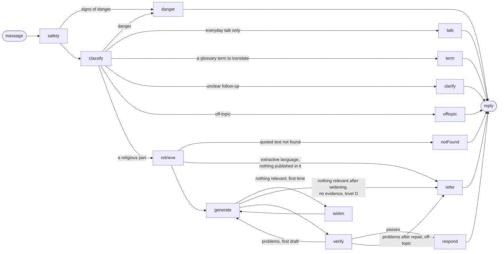

# Reliability

Rafiq is the product's AI companion. The rules it has to keep are in `CLAUDE.md`:

- Religious content comes only from approved sources.
- Sacred text is never generated.
- Every statement carries a source.
- There are no fatwas.

This document explains how the code in `ai/app/rafiq/` and `ai/app/retrieval/` enforces those rules. The prompts describe the policy to the model; the **code** decides what reaches the user. Every check and repair below works on the structure of an answer (paragraphs, list items, sentences, markers, blocks) and on what retrieval returned. None of them refers to a particular question, topic, verse or hadith, so they hold for any question, in any of the five languages, whatever model `LLM_MODEL` names.

**Lesson text.** Lesson text is taken verbatim from the approved sources named on each lesson, or is marked as the team's wording («صياغة فريق رحلة» / "Wording by the Rehla team") and rests on a cited verse or hadith. The team checked every lesson. No scholarly review is claimed: `reviewed` stays `false` and `reviewedBy` is empty in every lesson file.

These guarantees never bend:

- No religious statement is shown without a source among the retrieved passages.
- No verse or hadith text is produced by a model.
- No ruling is given on a fatwa or a personal case.
- When no adequate source exists, Rafiq refers instead of answering.

## Two ways of talking

Rafiq is a companion first, so he talks in two ways, and the line between them is drawn per part of a message, not per message.

| | Everyday talk | Religious knowledge |
|---|---|---|
| What | Greetings, thanks, feelings about the road, "what next?", an ordinary shared post, practical advice | Anything that states what Islam teaches: belief, worship, rulings, meanings, virtues |
| Source | None, because it makes no religious claim | Always: approved passages, cited sentence by sentence |
| Checked by | The warm-line checks, on the whole reply (below): no marker, no copied sacred text, no religious statement, in the right language, not a repeat, no stock phrase | Everything in Verification and repair |
| Ends in | A reply; never `noSource`, "could not verify", or a referral | An answer, or an honest card |

`classify` returns `religiousPart` (the part that needs knowledge, as one question that stands alone) and `talk` (an everyday part is present). A message with no religious part goes to `talk`; a mixed message goes to `retrieve`, and its everyday part is answered in the draft's `talk` field, under the warm-line checks. If no everyday line of the draft passes, the everyday part (or a worry about one's own worship) is answered on its own through `talk.md`, told that the question is answered separately: it is never left without a reply. The everyday line is strict: naming a topic ("your first Ramadan") is not a claim; saying what the topic teaches is.

**Voice** (`voice.py`, all in code): no stock framing or praise of the question ("great question", «سؤالك مهم»), no stock closing ("is this clear?"), no opening or closing shared with the previous reply, and the learner's name (`{{name}}`, filled in on the device) at most every third reply and never twice in a row. A line that breaks these is trimmed or dropped, never sent back as a referral.

## The graph

Rafiq is a LangGraph state graph (`ai/app/rafiq/graph.py`). The whole run has a 45-second budget: past it, the reply is the "could not check in time" card (`timeout`), never a platform error.

| Node | What it does | Where |
|---|---|---|
| `safety` | A code check of every message (and a shared post) for signs of danger, before any model is asked. It cannot be skipped. | `safety.py` |
| `classify` | One model call that returns a validated `Classification`: language, level A–D, intent, the religious part and the everyday part, question type, personal case, worship worry, hostile tone, misconception, a question about agreement, a term to translate, a quoted verse or hadith, search phrases in Arabic and English, and the follow-up rewritten to stand alone. A field the model leaves null takes its default. A message whose own words hold no Arabic letter is never answered in Arabic or Urdu, whatever a quoted term inside it is. A personal case is set to level D. | `prompts/classify.md`, `schemas.py`, `llm.py` |
| `talk` | Everyday talk: a short reply from `prompts/talk.md`, with the learner's road for "what next?". Checked sentence by sentence; a sentence that makes a religious claim is dropped, the rest stays. | `graph.py` |
| `term` | "Translate this term", for a term in the organisers' glossary: the approved equivalent first, then the usage rule, then TerminologyEnc's definition when stored, all verbatim. No model writes any of it. A request to explain a term (rather than translate it) goes through the sources instead. | `glossary.py` |
| `retrieve` | At most 10 numbered passages from approved sources, searched in Arabic and English for every language (see Retrieval). | `retrieval/retriever.py` |
| `generate` | Writes the draft from those passages only: which passages are relevant, the direct answer, the verses and hadiths to show (as placeholders), the explanation, and the everyday lines. | `prompts/generate.md`, `prompts/shapes/*.md`, `prompts/rules/*.md` |
| `widen` | When no passage answers the question, one more search in the approved sources' own search (MCP), with the Arabic and English search phrases. | `retriever.py` (`widen`) |
| `verify` | Code checks, then one model check of support, relevance and the everyday lines. The first time it finds problems the draft is written again; the second time they are repaired in code. | `draft.py`, `check.py`, `repair.py`, `glossary.py`, `prompts/verify.md` |
| `respond` | Shows every verse or hadith the answer relies on, from its stored or published text; shows a verse or hadith the answer carries from a book's text from its own source; numbers the source cards; adds the referral the policy calls for. | `repair.py` (`finish`), `embedded.py`, `compose.py` |
| `refer` | No religious content: a kind opening (if it passes the checks) and a card that states its reason. | `graph.py`, `policy.py` |
| `notFound` | A text asked about as a verse or a hadith that the approved sources do not hold: said plainly (`verseNotFound`, `hadithNotFound`), with no reference invented. | `graph.py` |
| `clarify` | An unclear follow-up: one short question back instead of a guess. | `graph.py` |
| `offtopic`, `danger` | Fixed cards; no model writes any of it. | `graph.py`, `web/messages/*.json` |

## The policy as code (`ai/app/rafiq/policy.py`)

| Level | Scope | What the code does |
|---|---|---|
| A | Stable facts | Full answer from the passages, with sources. |
| B | Explanation | Full answer from the passages, with sources. |
| C | Disputed or sensitive | Adds the *disputed* rule: the answer may say scholars differ only where a passage says so, and never claims an agreement the passages do not state. The sourced general information is followed by a referral with reason `disputed`; if the passages are not adequate, the referral comes alone. |
| D | Fatwa or legal or medical case | Adds the *general information only* rule: no ruling of any kind, not even in general terms. **The answer is always referred** (reason `fatwa`), whatever the model writes. |

The model cannot override these points:

- **A personal case is treated as level D**, whatever level the classifier gave it. It is always referred, with reason `personalCase`.
- **A request for evidence** (such as "give me a hadith proving…") is answered only when the model confirms that a passage proves exactly what was asked. Otherwise the reply is `noEvidence`: Rafiq says that no matching evidence was found, and never invents one.
- **No adequate passage** leads to `noSource`: Rafiq says so plainly and refers the learner to a specialist (see Referral to a specialist).
- **Distress** adds the *distress* rule: care first, no counselling, and general information only if a passage gives it. It always ends with a referral (`distress`).
- **Off-topic** requests are declined (`offTopic`) with no retrieval and no model-written content.
- **Everyday talk** gets a short human reply (`talk`) with no sources and no referral card. A greeting or a thanks alone is never treated as a question.
- **A source shown with no explanation** that passed its checks is not passed off as an answer: the draft is written again once, then the sources are shown with an honest card (`unexplained`).
- **A quoted text that is not a verse or hadith** in the approved sources is said to be not found (`verseNotFound`, `hadithNotFound`). A verse quoted in other words is shown as published, followed by a fixed line that the quoted words differ.
- **A ruling or a personal case, in any language,** is cut down in code (`guard.py`), whatever the model wrote: at most one plain sentence saying what the topic is, kept only if it has no ruling word (valid, invalid, void, allowed, forbidden, must, halal, haram, «يجوز», «باطل», «يجب»…) and says nothing to the asker about their own case; at most one verbatim source block as background (a verse or hadith it showed, else the book passage it cited); the fixed line "This is general information. It is not a ruling on your situation."; then the specialist card, which says the answer depends on details a specialist must hear. An everyday line beside it that uses ruling words is dropped.
- **The policy's card wins.** When a personal case, a fatwa or a disputed matter is also shown without an explanation, the card is the policy's (`personalCase`, `fatwa`, `disputed`), not `unexplained`.
- **The time budget** (45 s) ends in `timeout`, and the **daily cap** (`DAILY_QUESTION_CAP`) in `dailyCap`: neither calls a model again.

## The shape of a religious answer

In reading order, and enforced in code (`repair.in_reading_order`, `compose.py`):

1. **The direct answer:** one or two plain sentences, each with its marker, labelled "Generated answer".
2. **The sources, verbatim:** at most two verse or hadith blocks, as their publishers print them.
3. **The explanation:** two to five short paragraphs in everyday words, labelled "Generated explanation". Each paragraph carries the markers of the passages it rests on, and is checked as a whole for support: one regeneration, then that paragraph alone is removed.
4. **Encouragement and one next step:** everyday lines, under the warm-line checks.

Under every answer, three quick actions ask the follow-up for the learner: "Explain more simply", "Tell me more", "What do I do now?". The explanation boundary: everything Rafiq says about what Islam teaches is in the answer or the explanation, cited; the encouragement and the next step say nothing religious. A reply that would show only sources is written again once; if it still explains nothing, the sources are shown with the `unexplained` card rather than as an answer.

`classify` names the question type, and `generate` receives that type's shape (`prompts/shapes/`). The examples in those files are shape-only slots; none of them is about a topic.

| Type | Shape of the direct answer and explanation |
|---|---|
| definition | What it means in plain words, then its name |
| howTo | A lead-in, then numbered steps in the source's order |
| evidence (also virtue and reward) | One or two sentences, then the verse or hadith block, then what it shows |
| list | A lead-in, then the whole list as the source gives it |
| comparison | A short paragraph for each side, then how they relate |
| other | One or two short paragraphs |

Behaviour rules add to the shape where the classifier finds the need (`prompts/rules/`): a misconception is corrected first, gently, from a source; hostile wording gets a calm answer to the actual question, without conceding the information; a question about agreement never gets a consensus claim unless a passage states it (with the level C note); a worry about one's own worship gets reassurance first, then general information, then the specialist card; "explain to someone who never heard the term" gets plain words first, then the term; a request for fabricated evidence is refused without praising the request; a personal case outside Saudi Arabia gets the specialist card led by that guidance, not the city picker.

## Retrieval (`ai/app/retrieval/`)

Retrieval uses only the approved sources (`content/sources.json`):

1. **Local index** (`ai/data/index/`, built by `uv run python -m app.ingest`). It holds:
   - the lesson books from IslamHouse and Byenah, split at paragraph and subheading boundaries;
   - «بينات: أسئلة وأجوبة عن الإسلام» (Osoul Center, dawa.center), one chunk per question: the question with the book's own summary answer;
   - TerminologyEnc terms;
   - the hadiths and verses the lessons and the Mawqif situations reference;
   - the HadeethEnc catalogue titles.

   Search is hybrid: cosine similarity (`EMBEDDING_MODEL`) and BM25 with Arabic normalisation, merged by reciprocal rank fusion. It searches first within the lessons the learner has reached. **It is cross-lingual for every language:** the Arabic index is searched with the question and the classifier's Arabic search phrase, the English index with the question and the English phrase, whatever language the question is in. The answer's own language comes first; the other index adds at most three book passages (never its verses or hadiths, which are shown from their published text in the answer's language). The question is searched together with the classifier's search phrases, and English transliterations such as "wudu" are paired with their English names from the stored TerminologyEnc entries. Book paragraphs that hold Quran text are not indexed: verses come only from the Quran sources.

   Each book piece is searched, embedded and shown with its section heading, and its reference names that heading and the piece's own subheading. A piece that opens with "They are six:" names its subject only in the heading, so without it neither the search, nor the model, nor the support check could tell what the list is about.

   **List questions** (`questionType: "list"`) read book pieces before hadiths and verses: a book gives the whole list, a hadith one item of it. The two best book pieces come with the rest of their list: the pieces of the same section from the subheading that opens it to the next one (at most three). A list the chunk size cut is read whole.
2. **Hadiths through the catalogue.** A catalogue title that matches well leads to the hadith itself. A stored hadith is read locally; any other is read through MCP `get_hadith` (at most 3).
3. **A quoted verse** is looked up on the MCP server (`search`, then `get_quran_verses`). If the quoted wording differs from the verse, the real verse is shown and the answer says gently that the wording is different.
4. **Only when local results are weak** (best cosine below 0.50), the server's search is used:
   - for Arabic and English, through at most two keyword queries the model writes;
   - for the other languages, with the question itself.

   Library hits carry no text and are ignored.
5. **Later lessons.** When the learner's reached lessons have nothing strong and a later lesson does, the answer names that lesson (`laterLessonId`).
6. **The relevance gate.** `generate` first says which passages answer the question asked (`relevant`). Only their verses and hadiths may be shown; a nearby passage is never shown beside an answer it does not support. If none is relevant, retrieval widens once (`widen`, above); still none ends in `noSource`. The model check also judges whether the answer responds to the question asked; an answer to a nearby question is not shown.

The MCP client (`retrieval/mcp.py`) makes one request at a time with an 8-second timeout. It backs off on 429 and caches replies in memory (per serverless instance, so the cache is best effort). If the server is down, Rafiq continues with the local sources and logs only the failure.

## Languages and the extractive mode

Rafiq answers in Arabic, English, Urdu, Bengali and French. Everything about a language is one row of a table (`ai/app/languages.py`, and its twin `web/src/lib/rafiq/languages.ts`):

- its code and direction;
- its font;
- its QuranEnc translation (key, name, version);
- its HadeethEnc language code;
- whether the local books are written in it.

Adding a language is adding a row. A question in any other language is answered in English, with one line saying so.

**Arabic and English** are answered in full from the lesson books, terms, verses and hadiths.

**Urdu, Bengali and French are answered extractively.** The lesson books exist only in Arabic and English, and a model's translation of them would put words in the reader's language that no publisher has checked. So for these languages:

- **Search.** The local index is searched in Arabic and English, as for every language. Only the verses and hadiths found there are kept.
- **Fetching.** Those verses and hadiths are fetched in the answer's language through MCP: `get_quran_verses` with that language's QuranEnc translation, and `get_hadith` with the Arabic alongside.
- **The answer's shape.** First the verse or hadith block. Then HadeethEnc's own explanation in that language, quoted and attributed. Then at most two connecting sentences from the model, each with its marker; `finish` enforces that limit in code. Religious terms keep the wording of the published translations.
- **Missing translations.** A hadith with no version in that language is shown with its English one, and the block says which language that is. Verses in Bengali answers use QuranEnc's `bengali_rwwad` (Rowwad Translation Center). QuranEnc's translation list omits Bengali, but its verse endpoint serves it; it has no published version number, so the block shows the name only.
- **No passage in the language at all** leads to a referral (`noSource`). Rafiq never answers from a model translation of Arabic or English sources.

The translations used, with their keys and versions, are recorded in `docs/SOURCES.md`. The referral, disclosure, small-talk, opening, follow-up and clarifying messages in Urdu, Bengali and French are in `web/messages/answer-languages.json`, awaiting native review; `_changedForReview` lists the lines changed most recently.

## Sacred text is always shown, exactly as published

- **Placeholders only.** The model writes only placeholders. `compose.py` replaces each one with the text stored or fetched for that passage:
  - a verse: the Arabic as QuranEnc publishes it, the surah name (from mp3quran.net) and ayah number, and the published translation with its name and version;
  - a hadith: the Arabic as HadeethEnc publishes it, the published translation in the answer's language, the attribution and grade, and the link.
- **No changes on the way.** Nothing between the source and the screen normalises, trims or retypes these texts. The MCP parser keeps the lines between its `[EXACT]` markers whole. Three tests compare them byte for byte:
  - `ai/tests/test_check.py` checks the stored files against the response;
  - `ai/tests/test_boundaries.py` checks an MCP reply against the response;
  - `web/src/components/rafiq/answer-blocks.test.tsx` checks the stored files against the rendered page.
- **Long texts.** A long text is shown whole: CSS clamps it after six lines, and "Show all" opens it.
- **Shown whenever relied on.** When a sentence cites a verse or hadith passage and the answer has no block for it, `finish` inserts the block after that paragraph or list.
- **At most two blocks.** An answer shows at most two blocks, the most relevant first: the misquoted verse, then by retrieval rank.

## Verification and repair

`draft.py` parses the draft into paragraphs, list items, sentences and blocks:

- **Any marker style.** It reads markers in every common form: `[1]`, `[1, 2]`, `[1][2]`, `[2-3]`, and Arabic, Persian or Bengali digits.
- **Sentence ends.** It ends sentences at `. ! ? ؟ ۔ ।`.
- **Markers after the full stop.** A marker written after a sentence's full stop belongs to that sentence.
- **Paragraph and item markers.** A marker that closes a paragraph or list item covers that paragraph's or item's sentences.

`check.py` then finds problems, each with a category:

| Category | Found when |
|---|---|
| `unmarked` | A sentence of four or more words has no marker covering it. A lead-in of up to 8 words that ends with a colon before a block, or a list introduction of up to 12 words, needs none. |
| `unknownMarker` | A marker points to no retrieved passage. |
| `unknownBlock` | A placeholder names no retrieved passage. |
| `copiedSacred` | The prose shares a run of words with a verse or hadith: its Arabic or its translation, 7 words in Arabic script, 9 otherwise. A run that a retrieved book or term passage also contains is allowed, since a lesson book that quotes a verse may be summarised in its own words. |
| `verseBrackets` | Quran brackets ﴿﴾ appear in the prose. |
| `wrongLanguage` | A sentence of twelve letters or more is not mostly in the script of the answer's language (Arabic script for Arabic and Urdu, Latin for English and French, Bengali for Bengali). A term or name in another script is allowed. |
| `missingVerse` | A misquoted verse is not shown. |
| `tarjih` | Rafiq's own words pick a winner between scholarly views ("the correct view", «الراجح», «الصحيح من القولين», "closest to the truth"), or bless the difference ("disagreement is a mercy", «الخلاف رحمة»). Only a verbatim block may say that. |
| `consensus` | A sentence claims that scholars agree, or that they differ, and none of its cited passages speaks of agreement (or of difference). |
| `offTopic` | The model check finds that the answer does not respond to the question asked. |
| `unexplained` | The reply would show a verse or hadith with no explanation of it. |
| `unsupported` | The model check (`prompts/verify.md`) finds a sentence (of the direct answer, or of the explanation, judged against every passage its paragraph cites) holding a factual or religious claim its passages do not state, including a generalisation about history, science, health, the wisdom behind a ruling, or what scholars agree or differ on. For a fatwa or a personal case it also lists every sentence that states a ruling (allowed, forbidden, obligatory, valid, what the asker should do), even one its passage supports (`prompts/rules/verify-general.md`): there, general information may explain, never rule. This ruling guard applies to the cited sentences only, never to the warm lines. |

**First draft:** any problem sends it back to `generate` once, with the problems listed.

**Second draft:** problems are repaired in code (`repair.py`) instead of being refused at once. A repair only removes or replaces, it never adds words of its own:

- A sentence with no marker, an unknown marker, Quran brackets, no support, a picked winner, an unsupported consensus claim, or in another language is removed. An explanation paragraph judged unsupported is removed whole, and alone.
- A placeholder that points to nothing is removed.
- A sentence that copies a verse or hadith is replaced by that passage's block, placed once.
- Before anything is removed, each sentence's covering markers are written onto it. Removing the sentence that closes a paragraph then never leaves the others without their source.

The code checks run again after each round, for up to three rounds. The draft is referred (`verification`) only if problems remain or nothing cited is left: neither a cited sentence nor a verse or hadith block. For a fatwa, a personal case or distress the referral keeps that reason instead (`fatwa`, `personalCase`, `distress`): a guard that removes every ruling is the policy working, not a failed answer. A published block shown alone, with its source card, is a valid answer. The model check then runs on what is left, and unsupported sentences are removed the same way.

**The organisers' glossary** (`content/glossary-p7.json`, `glossary.py`). In an answer that is not in Arabic, a glossary concept is named in its approved form. TerminologyEnc's own English names for a concept are the other renderings ("Monotheism" for التوحيد, "Religious opinion" for الفتوى): where the answer uses one and no approved form, code puts the approved form in its place before the checks ("Tawhid (Oneness of God)"). A concept with two approved forms named by only one of them gets the whole form at its first mention. The model is given the approved forms of the concepts its question and passages name.

**Verses and hadiths inside a book's text** (`embedded.py`). A book may quote a verse or a hadith, and the copied-text check lets a run of an approved book through. In `respond`, every such quote the answer carries (five words in a row) is looked up: by the reference the book gives, then in the stored verses and hadiths, then through the approved sources' search, kept only if it shares the quote's words. A verse found replaces the sentence with the QuranEnc block; a hadith found replaces it with the HadeethEnc block, which shows its grade. A hadith not found stays as the book quotes it, followed by the fixed line "The source does not state this hadith's grade". A hadith block with an empty grade shows the same line, so no hadith is shown as graded without a grade.

The browser adds one more guard (`web/src/lib/rafiq/answer.ts`): a reply that carries content without sources is turned into a `noSource` referral before it is rendered.

## Conversation (`classify`, `ai/app/rafiq/prompts/classify.md`)

The service keeps nothing between requests. The page sends the last 8 turns (`history`) with each question, and Rafiq works from those turns only:

- **Follow-ups.** `classify` rewrites a follow-up such as "and after that?" into a question that stands alone (`standalone`), using only what the history says. Retrieval and generation work on that question, so a follow-up is searched and cited like any other.
- **Unclear follow-ups.** When the history does not make the question clear, `classify` sets `unclear` and writes one short question back (`clarification`). The reply is that question (`kind: "clarify"`); Rafiq does not guess.
- **Referring back.** Rafiq refers back only to what is in the history ("as we said about…"). It never claims to remember anything else, and it never sees the learner's name.

## Book passages shown verbatim

A book passage is shown as it is, as a block labelled with its own language (`BookBlock`), in three cases: the answer cites a question-and-answer book's own answer to the question («بينات», whose points the explanation then follows in order); the answer cites a passage in another language than the reply (an Arabic passage explained in English); or it is the background block of a ruling or personal-case reply. No book passage is ever reworded into a block.

## Readings that follow from the form of a question

Two readings are made in code from how a question is put, whatever the classifier said (`_by_question_form` in `graph.py`): a question with a quoted text («…») and the word "verse" or "hadith" («آية», «حديث») asks whether that text is one, and is answered by looking it up (`verseNotFound` / `hadithNotFound` when only the text itself does not match); and a question whether something the classifier rated as disputed (level C) is forbidden or allowed ("Is … haram?", «هل … حرام؟») is a request for a ruling, so level D and its guard apply.

## Questions in other languages

Before classification, a message not written in Arabic or English gets plain English and Arabic forms from one model call (`prompts/normalize.md`). They are aids for routing and search only, never shown: the classifier reads them beside the message, whose own language still decides the answer's language, and both index languages are searched with them. A question is not routed off-topic or left without sources only because of its language.

## Voice in religious answers

A religious answer starts with the answer: there is no opening line unless the learner said something personal (a feeling, a worry, their own situation). No praise of the learner or of the question anywhere, and no encouragement line. The ending is at most one short, specific next step, often none. In everyday talk, returning the greeting the person used is the ordinary courtesy; nothing religious goes beyond it: other religious formulas («الحمد لله», «إن شاء الله», "alhamdulillah"…) are removed from everyday lines in code (`voice.without_formulas`).

## The fields of a draft

`generate` returns one JSON object (`Draft` in `schemas.py`):

| Field | What it holds | Limit (code) |
|---|---|---|
| `relevant` | The numbers of the passages that answer the question asked | the relevance gate |
| `opening` | A kind line that meets the person, when it helps | 2 sentences, 240 characters |
| `talk` | The everyday part of a mixed message, answered as a friend | 4 sentences, 600 characters |
| `answer` | The direct answer: one or two sentences, each with its `[n]` marker | the answer shape |
| `show` | At most two placeholders of the verses and hadiths that support it | relevant passages only |
| `explanation` | Two to five paragraphs, each with its markers | checked per paragraph |
| `encouragement` | One line about the learner's effort, never a religious statement | 2 sentences, 240 characters |
| `followUp` | One next step or one short question back | 1 sentence, 180 characters |

The tone is that of a kind older friend: plain words, short sentences, no emojis, no flattery, no lecturing, never the same line twice in a conversation.

### Why warmth cannot carry claims

The opening and the follow-up have no source markers, so nothing could show where a religious statement in them came from. If they were allowed to carry one, they would be a way around every check on the answer. So they are held to a stricter rule than the answer: **they may say nothing religious at all.** `warmth.py` drops a line, in code, when it:

- holds a source marker, a verse or hadith placeholder, or Quran brackets;
- shares a run of words with a retrieved verse or hadith (the same `copiedSacred` test as the answer);
- is not written in the reply's language (the same `wrongLanguage` test as the answer);
- repeats a line from an earlier reply in the history;
- is longer than its limit even when cut to its first sentence (a line keeps the most whole sentences that fit).

Then the same single model check that tests the answer's support (`prompts/verify.md`) lists any warm line that makes a religious statement (`religious`), and that line is dropped too. If that check cannot run, every warm line is dropped. A dropped line is simply not shown: it never causes a referral, and the cited answer stands on its own.

The ruling guard of a fatwa or a personal case does not apply to warm lines: they keep only the religious-statement test. An opening that passes is shown whichever way the reply ends: an answer with the referral after it, an answer whose every sentence the guard removed, or a draft the model marked inadequate.

The same checks hold every line written outside the pipeline as everyday talk (`Rafiq.everyday`): what Lens says it can see in a photo, and Mawqif's scenes, the other person's lines and the feedback.

In Urdu, Bengali and French the model writes no warm lines. The page shows fixed lines from `web/messages/answer-languages.json`, marked for native review.

## Mawqif: practice conversations

In practice (`ai/app/mawqif/practice.py`), the model plays the other person in a fresh scene, and each learner reply is one strict-JSON call: the person's next line, the key points met, the tone, and three flags (a religious question, a ruling on one's own case, distress).

- **Before any model**, every reply is checked for danger in code. Distress brings the care card; a ruling on one's own case brings the specialist card; a religious question pauses the scene for Rafiq's own answer, then the scene resumes.
- **The other person speaks everyday speech only.** Every field of the scene, and every line after it, passes the everyday-talk checks; a line that fails is asked for once more, then the turn falls back to the written choices with a calm note. The scene never guesses the learner's gender or background.
- **Feedback** says what was good, what was missing and a better reply. A key point the turns found met is never called missing. Religious words in a better reply are only the situation's own quotes, inserted by code from `{{say:ID}}` placeholders; the model's own words in it pass the everyday checks, or the suggestion is not shown. It is offered as "you could say", never as a correction.
- **20 seconds per call; nothing typed is stored or logged.**

## Mawqif: written replies

A reply the learner writes in a Mawqif role-play is judged against that turn's key points only (`ai/app/mawqif/evaluate.py`). The model writes no religious content: it returns key point ids, a tone, two flags and at most one encouraging sentence. The page builds the feedback from fixed strings and the quoted sources of the missing points. The encouraging sentence passes the same warm-line checks as Rafiq's openings (code, then the model check); otherwise it is dropped. Signs of danger are caught in code before any model is asked; distress gets the specialist card; a religious question is not judged and is offered to Rafiq, where every check applies.

## Lens: the decision table

Lens (`ai/app/lens/`) answers when it should, declines when it should, and never guesses. The vision model only reports what it sees; `decide.py` applies this table in code, and `ai/tests/test_lens.py` has one test per row. EXPLAIN is never called for rows 7 to 11.

| Row | When | What Lens does |
|---|---|---|
| 1 | An object of worship or of a mosque (prayer mat, mihrab, minbar, wudu area, miswak, a closed mushaf) | Names it, then Rafiq's sourced explanation |
| 2 | A place (mosque, prayer room, qibla sign) | The same |
| 3 | Ordinary text (sign, notice, label, door plate), in any language | The exact text and a labelled machine translation; a sourced explanation only of a religious term the text really holds |
| 4 | A verse or hadith that matches the approved sources exactly | The QuranEnc or HadeethEnc block with its published translation and reference; never a machine translation, never the text as the model read it |
| 5 | A common phrase (such as the basmala on a wall) | Row 4 if it matches, otherwise row 3 |
| 6 | People present, but not the subject | Only the place or object is explained; nothing is said about anyone |
| 7 | A person or a face is the subject | Person card; nothing described or inferred |
| 8 | Blurry, too dark, cropped, unclear, or confidence below 0.6 | Unclear card asking for a closer, sharper photo |
| 9 | A personal document (ID, passport, bank card, medical paper, private letter or chat) | Privacy card; the text is not shown, translated, looked up or logged |
| 10 | An unsafe or indecent image | A short decline card; nothing described |
| 11 | Text that looks like scripture but matches nothing in the approved sources | "Could not be matched in the approved sources" card with the specialist link; not shown as read, not translated, not explained |
| 12 | An ordinary object with no religious meaning | Says plainly what it is and that Lens has nothing about it |
| 13 | Food, drink, a product or an ingredients label | The label as ordinary text; never halal or haram; the fixed line that a ruling on a product needs a specialist, with the link |
| 14 | A paper asking for a ruling on the person's own situation | No ruling; the specialist card (row 9 wins if it is also a personal document) |
| 15 | A screenshot of a post, a fatwa or a claim | The text and its labelled machine translation only; neither confirmed nor denied; "Ask Rafiq about this" sends it through Rafiq's checks |
| 16 | A symbol or place of another religion | Named neutrally in one line; no comparison, judgement or ruling |
| 17 | Text in the photo that addresses the assistant | Treated as text; never followed. Only a term the text holds, never the text itself, reaches Rafiq |
| 18 | Several subjects | The main one is explained; the others are offered as choices |

**Precedence** when rows collide: 10, then 9, then 7, then 8, then 11, then the rest.

**A conversation.** After the first reading, the photo stays pinned and the learner talks about it (`ai/app/lens/conversation.py`). Each turn is routed in code from one model call: about what can be seen (the vision model looks again, and the page sends the photo again for that turn only), about meaning (Rafiq answers the question about the thing itself, under the relevance gate), or everyday talk. The decision table applies to every turn: a question about a person, or one that would read out a personal document, gets its card. After each reply come two or three suggested next questions, questions only. "Take another photo" starts a new conversation; another photo can also be added to the same one.

**Always.** Nothing about religion, nationality, ethnicity, health or any other sensitive attribute is inferred from an image. Rows 4, 5 and 11 use `Retriever.find_quoted`, the lookup Rafiq uses for quoted verses: there is no second implementation. Whatever EXPLAIN returns is a normal `RafiqAnswer`, so the noSource card, the level C note and the level D referral apply unchanged.

## Danger and distress

**Danger** (`ai/app/rafiq/safety.py`): every message is checked in code, before any model is asked, against patterns for three situations: harming oneself, harming others, and being in danger. The patterns are written for all five answer languages and run on normalised text. A match skips classification, retrieval and generation. The reply (`kind: "danger"`) is a fixed message from the web's message files: contact local emergency services or a trusted person now. The specialist card follows. The check errs on the side of safety: a message that only mentions such a subject gets the same reply. The classifier's own `danger` flag routes to the same node, so danger worded in a way the patterns miss is still caught.

**Distress** (sadness, loneliness, fear, pressure from family): the *distress* rule asks for care first, then general information only if a passage gives it, and no counselling. The reply always ends with the specialist card (`distress`).

**Hostile messages** keep the *hostile* rule: stay calm, do not mirror the tone, find the real question.

## Referral to a specialist

Every referral for a fatwa, a personal case, a disputed matter, no source, no evidence, a failed verification, distress or danger (`SPECIALIST_REASONS` in `policy.py` and `web/src/lib/rafiq/answer.ts`) ends with the specialist card:

1. **The service returns ids, not names.** The referral carries its `reason`, the link `/talk-to-a-specialist`, and `centers`: the ids of the bodies in `content/referral-centers.json`. The service never writes a name, number or address.
2. **The page renders the bodies from the data file** (`web/src/components/specialists/specialist-card.tsx`). An id that the file does not hold is not shown.
3. **The card's order:**
   - the national channel (1933), labelled as inside Saudi Arabia;
   - a city picker: the learner chooses a city (no location is read or guessed) and sees at most three associations there, with tap-to-call numbers;
   - a line for learners elsewhere: ask the nearest trusted Islamic centre in their country;
   - a link to the full list.
4. **The chosen city** is kept on the device only, listed under "What Rafiq remembers", and cleared with everything else.
5. **The specialist page** (`/[locale]/talk-to-a-specialist`; the old `/talk-to-a-human` redirects to it) lists every body, grouped by city, with the directory's name and the date it was read.

The directory is the National Center for Non-Profit Sector's list, converted by `scripts/referral-centers.mjs` from `content/referral-centers.source.json`. The source file is kept unchanged.

## Tone and disclosure

- **Hostile wording** adds the *hostile* rule: do not mirror the tone, find the real question, and answer it calmly.
- **AI disclosure.**
  - The Rafiq page opens with the AI notice.
  - Every answer ends with "Rafiq is an AI tool, not a scholar", in the answer's language.
  - Rafiq's own prose is labelled "Generated explanation"; verses and hadiths carry their publishers' names instead.
  - Every referral card says why Rafiq is handing over.
- **Answer language.** Each answer is in the language of the question. Arabic answers are in Modern Standard Arabic. Interface labels stay in the page's language.

## Models

- Model names come only from the environment: `LLM_MODEL`, `LLM_FALLBACK_MODEL` and `EMBEDDING_MODEL`.
- Every model reply is requested as JSON and validated against a Pydantic model. A reply that fails validation is retried once with the validation error; then the next model is tried.
- A model that answers 429 cools down for 60 seconds while the fallback model is used.
- `OPENROUTER_DATA_COLLECTION` is sent as OpenRouter's provider preference (`deny` by default).

## Privacy

- **Not stored, not logged.** Questions and answers are not stored and are not logged. A log line carries only the language, level, referral reason, counts and timings. A verify pass logs only its problem categories and their counts, such as `problems={'unmarked': 1}`.
- **The debug switch.** `RAFIQ_DEBUG=1` also logs each draft and the text of its problems. It is for local diagnosis only, off by default, and ignored on a deployment (when `VERCEL` is set).
- **Errors.** On the API, invalid requests are reported by field name, never by echoing the input.
- **The conversation** is kept on the device only (see `docs/PRIVACY.md`). The service keeps no conversation state.
- **What the browser sends.** `history` sends at most the last 8 turns, and `reachedLessonIds` sends lesson ids. The learner's name and city are never sent: Rafiq writes the placeholder `{{name}}` and the page fills it in on the device (`ai/app/rafiq/name.py`, `web/src/lib/rafiq/name.ts`).

## API limits

`POST /ask` and `POST /lesson-help` (`ai/app/api.py`):

- Questions are capped at 1,000 characters.
- Each IP may ask `ASKS_PER_MINUTE` questions a minute (default 10).
- `DAILY_QUESTION_CAP` questions a day (default 1500) are answered, counted per instance, across `/ask`, `/lesson-help`, Lens turns and Mawqif's "explain this". Past it, the reply is the `dailyCap` card and no model is called.

Errors have a fixed shape, `{"error": {"code": …}}`, with these codes:

- `invalid_request` (422)
- `rate_limited` (429, with `Retry-After`)
- `unavailable` (503, when no model can answer)

## Known limits

- **Model checks.** The support check and the classifier are model judgements. The code guards hold whatever the model says, but a misclassified level (for example, a fatwa question read as level B) reaches the general prompt rather than the level D rule. A misread language is answered in that language. The evaluation measures how often this happens (`docs/EVALUATION.md`).
- **Extractive coverage.** Urdu, Bengali and French answers are only as wide as the verses and hadiths the Arabic and English index leads to; a topic covered only by the lesson books is referred in those languages.
- **Glossary coverage.** The organisers' glossary has ten concepts. TerminologyEnc's definitions are stored for six of them (التوحيد، العبادة، النبوة، الحديث، السنة، الفتوى); for the others the term answer gives the approved equivalent and the usage rule only. Other renderings are known only where TerminologyEnc names them, so a rendering it does not use is not caught.
- **«بينات» extraction.** The book's headings and labels extract partly out of order and are recognised, not kept; some lines that mix type styles extract with their parts out of order; its verses are in a glyph font and are left out of the indexed text. Its page publishes no reuse licence (see `docs/SOURCES.md`).
- **Book quotes.** A verse or hadith inside a book is recognised by how books write a quote (quotation marks after "said" or "Allah says", Quran brackets, a stated reference). A quote written another way is not looked up.
